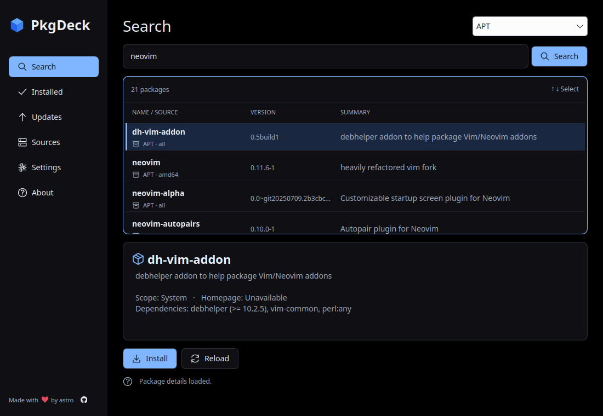
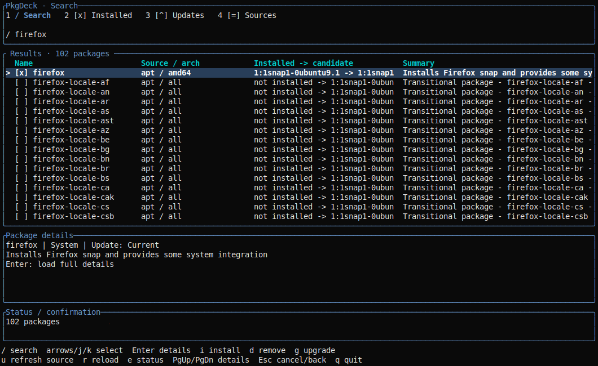

# PkgDeck

A unified package manager interface for Linux, built with Rust and Qt/Kirigami.

PkgDeck is built from one codebase with two frontends:

- `pkgdeck` — GUI frontend using Qt/Kirigami.
- `pkd` — terminal frontend without Qt:
  - `pkd` opens the interactive TUI.
  - `pkd <command>` runs a normal CLI command.

Both use the shared `pkgdeck-core` Rust library.

## Preview

Current design mockups; implementation is in progress.






## Planned initial support

- **System:** APT, DNF, Pacman, Zypper.
- **Applications:** Flatpak, Snap, Homebrew (Linux formulae), AppImage.
- **Development:** Cargo, npm, pnpm, Bun, pip, pipx, uv, Composer, RubyGems.

Development package managers will initially focus on user-installed command-line tools rather than project dependencies. pip support will be restricted to explicitly selected virtual environments.

AppImage support will initially cover importing local Type 2 AppImages, desktop integration, launching, and removal.

## Architecture

```text
pkgdeck-core   Shared package-management logic
pkgdeck        GUI frontend, with Qt/Kirigami
pkd            Terminal frontend, without Qt
               ├── TUI
               └── CLI
```

```text
pkgdeck ─┐
         ├── pkgdeck-core
pkd ─────┘
```

`pkgdeck-core` must remain independent of Qt. Package-manager logic lives in the core and is shared by both frontends.

Each backend exposes the operations it actually supports, such as detection, search, package details, installed packages, install, remove, update, and upgrade. Unsupported operations are reported explicitly.

## Terminal interface

Running `pkd` without arguments opens the interactive TUI:

```sh
pkd
```

CLI commands include:

```sh
pkd search neovim
pkd info neovim
pkd install neovim
pkd install neovim --from flatpak
pkd remove neovim
pkd list
pkd sources
pkd update
pkd upgrade
```

Commands will support consistent exit codes and machine-readable `--json` output where applicable.

If stdin or stdout is not attached to a terminal, `pkd` without arguments must not attempt to start the TUI.

## Implementation plan

### 1. Project setup

- Create a Cargo workspace containing `pkgdeck-core`, `pkgdeck`, and `pkd`.
- Keep the core and `pkd` independent of Qt.
- Connect the GUI to Qt 6/QML and Kirigami through CXX-Qt.
- Build the TUI with Rust terminal libraries such as Ratatui and Crossterm.
- Pin compatible Rust, Qt, Kirigami, and CXX-Qt versions.
- Support **x86_64** and **aarch64** as first-class target architectures.
- Build both executables and all package formats for both architectures in GitHub Actions from the start.

### 2. Shared engine and host execution

- Define backend capabilities and common package models.
- Prefer documented APIs and structured output over parsing human-readable text.
- Execute commands with argument arrays rather than shell strings.
- Resolve package managers and user environments on the host, not inside a packaging runtime.
- Keep all frontends unprivileged. Use polkit or existing host authorization mechanisms only for operations that require elevation.
- Never elevate Homebrew or user-scoped development tools.
- Coordinate GUI, TUI, and CLI writes with native package-manager locks.

For Flatpak, host package-manager execution will use [`flatpak-spawn --host`][flatpak-spawn] with the required D-Bus permission. AppImage and Snap builds must also validate their host-access and authorization paths before those operations are enabled.

### 3. First complete workflow

Implement APT and Homebrew first and complete one real lifecycle through the shared engine:

1. detect the backend;
2. search and inspect a package;
3. install it;
4. detect an update;
5. upgrade it;
6. remove it;
7. verify the final state using the underlying package manager.

The same lifecycle must work through the GUI and `pkd`, with both TUI and CLI paths where applicable.

### 4. Expand backend coverage

Add each group only after its supported operations pass integration tests:

| Order | Backends                          | Initial scope                                                    |
| ----- | --------------------------------- | ---------------------------------------------------------------- |
| 1     | APT, Homebrew                     | Native system packages and Linux formulae.                       |
| 2     | AppImage, Flatpak                 | Local AppImage management and Flatpak user/system installations. |
| 3     | DNF, Pacman, Zypper, Snap         | Native distro operations and Snap lifecycle management.          |
| 4     | Cargo, npm, pnpm, Bun             | User-installed CLI tools.                                        |
| 5     | pip, pipx, uv, Composer, RubyGems | Explicit environments and isolated user-tool installations.      |

For AppImages, manage only PkgDeck-owned files and desktop entries. Do not execute an imported AppImage merely to inspect its metadata.

### 5. GUI

Implement the GUI with Qt 6, QML, Kirigami, and CXX-Qt.

Planned screens:

- Discover
- Search
- Package details
- Installed
- Updates
- Sources
- Settings
- Help/About

Use system theme colors, dark mode, keyboard navigation, accessible labels, and virtualized lists or [`TableView`][qt-tableview].

### 6. TUI

Implement the interactive terminal UI inside `pkd`.

Planned views:

- Search
- Package details
- Installed packages
- Updates
- Sources
- Install/remove confirmation
- Operation progress
- Errors and authentication failures

The TUI must remain fully usable without Qt or a graphical session and must share the same backend logic and package models as the GUI and CLI.

### 7. Packaging and releases

Package `pkgdeck` and `pkd` together in every distribution format. There is no separate CLI or TUI release.

All release formats must support **x86_64** and **aarch64**. Architecture-specific backend limitations must be detected and documented rather than silently falling back.

The planned application ID is `io.github.astrovm.PkgDeck`.

| Format   | GUI                                     | Terminal interface                                                |
| -------- | --------------------------------------- | ----------------------------------------------------------------- |
| Flatpak  | `flatpak run io.github.astrovm.PkgDeck` | `flatpak run --command=pkd io.github.astrovm.PkgDeck [arguments]` |
| AppImage | `./PkgDeck.AppImage`                    | `./PkgDeck.AppImage --cli [arguments]`                            |
| Snap     | `pkgdeck`                               | `pkgdeck.pkd [arguments]`                                         |

With no terminal arguments, the `pkd` entry point opens the TUI. With a subcommand, it behaves as a normal CLI.

#### Flatpak

Build the Flatpak in the PkgDeck GitHub Actions workflow using the KDE runtime. Distribute it through https://github.com/astrovm/flatpak, not Flathub.

Release flow:

1. Build and test `x86_64` and `aarch64` `.flatpak` bundles in PkgDeck CI.
2. Attach the exact tested bundles to the tagged GitHub release.
3. Dispatch publication to `astrovm/flatpak`.
4. Let the Flatpak repository import, sign, publish, and verify the bundles without rebuilding PkgDeck.

#### AppImage

Build `x86_64` and `aarch64` AppImages in GitHub Actions with the required Qt/Kirigami libraries and plugins. `AppRun` launches `pkgdeck` by default and dispatches `--cli` to the bundled `pkd` executable.

#### Snap

Build and test `x86_64` and `aarch64` Snaps in GitHub Actions and publish release builds through [Snapcraft][snapcraft]. Validate confinement, host package-manager access, authorization, and both bundled entry points before marking Snap support production-ready.

## CI

All builds run in GitHub Actions for both **x86_64** and **aarch64**, including:

- `pkgdeck`
- `pkd`
- backend test fixtures
- Flatpak
- AppImage
- Snap

Pull requests run formatting, linting, unit tests, affected backend tests, coverage, and builds of all three package formats for both architectures without publishing.

Rust code must maintain at least **95% line coverage**, measured in CI with `cargo llvm-cov`. Generated bindings, vendored code, and other non-project generated sources may be excluded from the coverage calculation. CI must fail if coverage drops below 95%.

Tagged releases run the complete test and packaging matrix. Only artifacts produced and tested by CI are published; releases must not depend on local builds or manually prepared artifacts.

Flatpak publication to `astrovm/flatpak` and Snap publication to Snapcraft must also be triggered from GitHub Actions.

## Testing

Use real package-manager commands, synthetic versioned packages, and isolated environments.

| Area                     | Test environment                                                                                          |
| ------------------------ | --------------------------------------------------------------------------------------------------------- |
| APT, DNF, Pacman, Zypper | Separate distro containers with pinned images; VMs for privileged desktop workflows.                      |
| Homebrew                 | Disposable non-root Linux environment using the standard Linux Homebrew prefix and a controlled test tap. |
| Flatpak                  | Disposable VM with a local test repository and user/system installation tests.                            |
| Snap                     | Ubuntu VM with `snapd`, plus tests of the Snapcraft-published package.                                    |
| AppImage                 | CI-built Type 2 fixtures; extraction-based tests in containers and FUSE launch in a VM.                   |
| Development managers     | Disposable users, homes, prefixes, virtual environments, and controlled test registries.                  |
| GUI                      | Qt Quick Test plus end-to-end packaged-app tests.                                                         |
| TUI                      | Terminal interaction tests in a pseudo-terminal, including resize, keyboard navigation, and cancellation. |
| CLI                      | Tests without a display server, including scripting, JSON output, exit codes, and non-interactive paths.  |
| Architectures            | Build and run relevant tests on both x86_64 and aarch64.                                                  |
| Coverage                 | `cargo llvm-cov` with a minimum 95% Rust line-coverage threshold.                                         |

For every advertised capability, verify success and failure paths and confirm state using the underlying package manager rather than only PkgDeck output.

A release is considered supported only when its required tests pass on both **x86_64** and **aarch64**, and CI reports at least **95% Rust line coverage**.

## Distribution

Both entry points are built together and included in each CI-produced package:

- **Flatpak:** https://github.com/astrovm/flatpak, served from [flatpak.4st.li][flatpak-site], not Flathub.
- **AppImage:** GitHub Releases.
- **Snap:** [Snapcraft][snapcraft].

[rust-kirigami]: https://develop.kde.org/docs/getting-started/rust/
[flatpak-spawn]: https://docs.flatpak.org/en/latest/flatpak-command-reference.html#flatpak-spawn
[qt-tableview]: https://doc.qt.io/qt-6/qml-qtquick-tableview.html
[flatpak-repository]: https://github.com/astrovm/flatpak
[flatpak-site]: https://flatpak.4st.li/
[snapcraft]: https://snapcraft.io/
