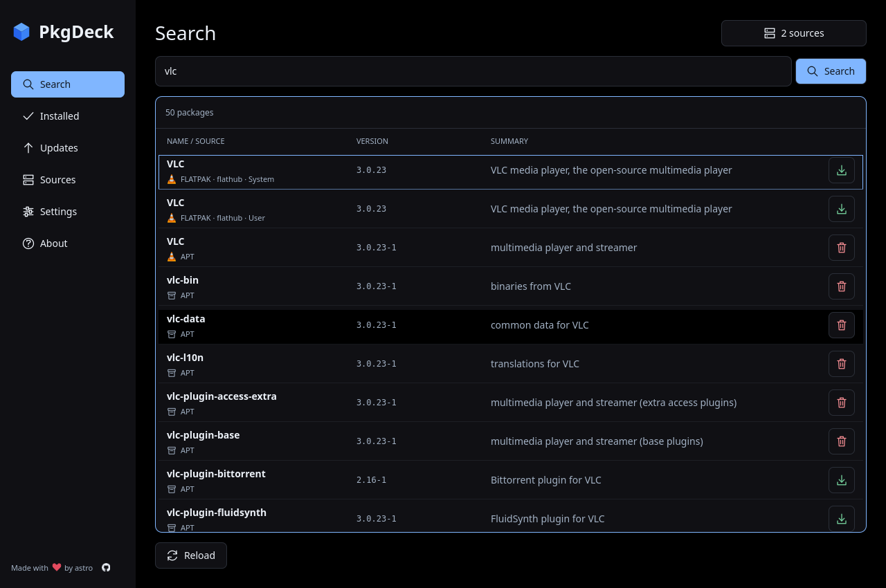

# PkgDeck

A desktop app and command-line tool for managing packages across multiple sources.
Compare apps, manage repositories, and install updates from one place. Both
frontends use the same Rust engine and your existing package managers.



## Install

| Platform | Homebrew package | Other options |
| --- | --- | --- |
| macOS | GUI (`pkgdeck`) and CLI (`pkd`) | Build from source |
| Linux | CLI (`pkd`) | Build the GUI from source; Linux packaging scripts below |

Until the first tagged release is published, install the development recipe with:

```sh
brew tap astrovm/pkgdeck https://github.com/astrovm/PkgDeck
brew install --HEAD astrovm/pkgdeck/pkgdeck
```

On macOS, run `pkgdeck` for the GUI or follow `brew info astrovm/pkgdeck/pkgdeck`
to add it to Applications. On Linux, Homebrew installs only `pkd` and does not
pull in Qt. APT metadata requires the optional companion reader built with your
distribution's `libapt-pkg-dev`; see [distribution](docs/distribution.md).

For a Linux source build, install the [development prerequisites](docs/development.md#sdk-and-prerequisites), then:

```sh
source scripts/dev-env.sh
cargo run --locked -p pkgdeck
```

## Use

- **Search:** compare the same app across sources and install a specific variant.
- **Installed:** filter packages, inspect details, and find duplicate installations.
- **Updates:** update individual packages or a selection, including firmware on Linux.
- **Sources:** choose managers and manage Flatpak repositories and firmware remotes.

The CLI works without Qt:

```sh
cargo run --locked -p pkd -- sources
pkd search vlc --from flatpak
pkd list --from homebrew
pkd upgrade --from homebrew
```

`pkd update` refreshes metadata; `pkd upgrade` updates installed packages.
Writes require confirmation. Native managers handle dependencies and authorization.

## Package sources

PkgDeck detects the managers available on the host. Supported adapters include
APT, DNF, Pacman, Zypper, Flatpak, Snap, Homebrew formulae and macOS casks, AppImage, Cargo, npm,
pnpm, Bun, pip, pipx, uv, Composer, RubyGems, and fwupd. Capabilities vary by
manager; `pkd sources` reports availability and unsupported operations.
Standalone Codex, Claude Code, Grok, and OpenCode installations also support
updates through their upstream updaters; see the [CLI guide](docs/cli.md#standalone-cli-tools).
Linux-specific managers and firmware support are not available on macOS.

Native, AppImage, and classic Snap builds can manage host packages. The Flatpak
build manages host Flatpak installations through its explicit host bridge.

## Documentation

- [GUI guide](docs/gui.md)
- [CLI commands, selection, and JSON output](docs/cli.md)
- [Development and verification](docs/development.md)
- [Distribution and Homebrew releases](docs/distribution.md)
- [Shared engine](docs/shared-engine.md)
- [Host execution and authorization](docs/host-execution.md)

## Development

```sh
scripts/verify.sh fast --engine podman
scripts/verify.sh full --engine podman
```

Tests use synthetic packages; real package lifecycles run in disposable containers
and virtual machines. See the development guide for focused checks and native setup.

Licensed under [MIT](LICENSE). The optional APT reader and bundled dependencies
retain their own licenses; package scripts include the relevant notices.
