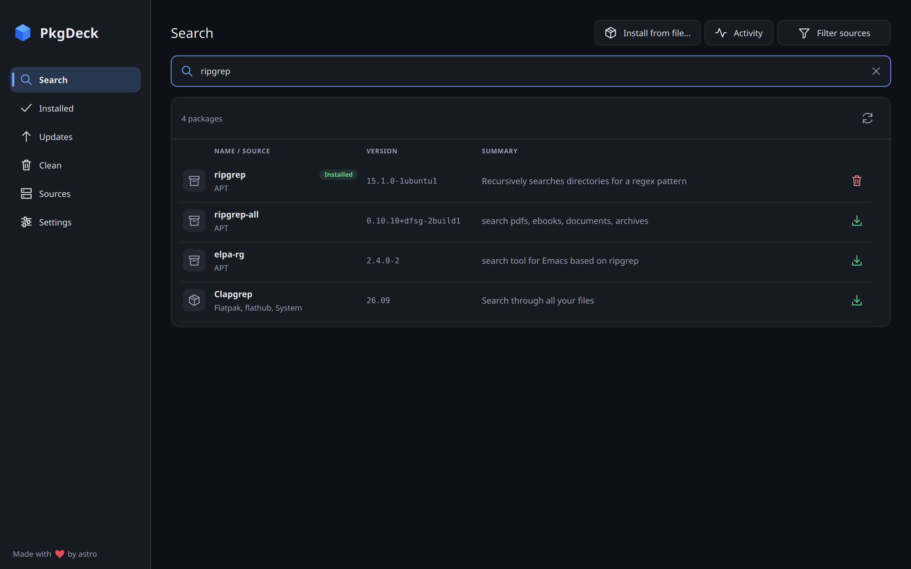

# PkgDeck

One app for every package manager.

Search, install, update, and clean up software in one place.



## Features

| Page          | What it does                                                                |
| ------------- | --------------------------------------------------------------------------- |
| **Search**    | Compare software across sources and pick the exact source and scope         |
| **Installed** | Browse installed packages and spot duplicate installs                       |
| **Updates**   | Apply one update, a selection, or everything at once                        |
| **Clean**     | Preview what will be removed before you confirm                             |
| **Sources**   | Turn package managers on or off and manage repositories                     |

PkgDeck works with the package managers you already have, like APT, Flatpak, Snap, Homebrew, npm, Cargo, Docker, and Podman.

Not every feature works with every source. See [supported sources](docs/gui.md) for details.

## 📦 Install

### Linux (Flatpak, recommended)

[Install PkgDeck](https://flatpak.4st.li/apps/io.github.astrovm.PkgDeck/install/) with one click, or run:

```sh
flatpak install https://flatpak.4st.li/io.github.astrovm.PkgDeck.flatpakref
```

Open PkgDeck from your app menu, or run `flatpak run io.github.astrovm.PkgDeck`.

Updates arrive through your software manager or `flatpak update`.

[GitHub Releases](https://github.com/astrovm/PkgDeck/releases/latest) also has AppImage and Snap packages.

### macOS (Homebrew)

```sh
brew tap astrovm/pkgdeck https://github.com/astrovm/PkgDeck
brew trust astrovm/pkgdeck
brew install astrovm/pkgdeck/pkgdeck
```

- This installs PkgDeck.app in `/Applications` and the `pkd` CLI.
- It needs macOS 26 or later.
- `brew trust` lets `brew upgrade` keep PkgDeck up to date. Without it, Homebrew 6 and later skip PkgDeck when upgrading.
- On Linux, `brew install astrovm/pkgdeck/pkd` installs only the CLI.

## ⌨️ Command line

With Flatpak, run the CLI like this:

```sh
flatpak run --command=pkd io.github.astrovm.PkgDeck
```

With other installs, run `pkd` directly:

```sh
pkd sources                      # list available package managers
pkd search vlc --from flatpak    # search one source
pkd list --from apt              # list installed packages
pkd refresh                      # refresh package lists
pkd upgrade                      # install available updates
```


`pkd` shows what will change and asks before doing it. Pass `--yes` to skip the question.

System-wide changes may ask for your password.

See the [CLI guide](docs/cli.md) for all commands.

## 🛠️ Build from source

Install the [prerequisites](docs/development.md#sdk-and-prerequisites), then run:

```sh
source scripts/dev-env.sh
cargo run --locked -p pkgdeck
```

## 📚 Documentation

- [GUI guide](docs/gui.md)
- [CLI guide](docs/cli.md)
- [Development and tests](docs/development.md)
- [Packages and releases](docs/distribution.md)
- [Host access and authorization](docs/host-execution.md)
