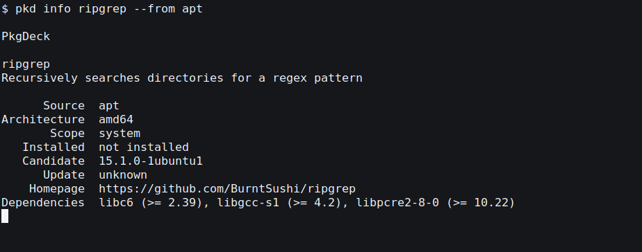

# Command-line interface

The `pkd` command exposes the shared engine. Native and AppImage execution
use the host boundary. Classic Snap uses that same boundary. The Flatpak build can
manage host package managers through its explicit host bridge.
`pkd` without a subcommand prints help and exits successfully, including with
redirected input/output. Use `pkgdeck` to launch the GUI.



## Commands and selection

```sh
pkd sources
pkd search neovim --from apt
pkd info neovim --from homebrew
pkd list --json
pkd install neovim --from apt --yes
pkd update --from apt --yes
pkd upgrade neovim --from apt --yes
pkd remove neovim --from apt --yes
```

`--from` accepts `fwupd`, `apt`, `dnf`, `pacman`, `zypper`, `snap`, `homebrew`, `homebrew-cask`, `appimage`, `flatpak`, `docker`, `podman`, `cargo`, `npm`, `pnpm`, `bun`, `pip`, `pipx`, `uv`, `composer`, `gem`, `codex`, `claude`, `grok`, or `opencode`, and repeats to select several sources. Without it, queries cover detected managers;
missing optional managers are omitted, while detection/query failures remain
visible. `sources` includes unavailable managers and their reasons. Search uses
literal case-insensitive substrings: APT names/summaries, Homebrew formula names,
and cask tokens.
Results rank best-match-first (exact name, name prefix, name substring, then
summary matches). Unverified name guesses are omitted.
Homebrew identities preserve tap-qualified names (for example
`owner/tap/formula`). Aliases and fuzzy matches are not installation selectors.

Install, info, remove, and named upgrades require an exact package identifier.
Matching identifiers across managers are ambiguous until a single `--from` pins the source.
Use `--arch` to distinguish APT architectures. Homebrew's detected prefix is part
of each identity; the CLI operates on the `brew` executable in the invoking user's
host PATH. It does not merge packages across prefixes or treat equal names as the
same application. Failed source queries prevent potentially ambiguous selection.

`install`, `remove`, and `upgrade` accept multiple names. Resolve all names before
any write; then execute each distinct operation in order. Execution failures do
not roll back successful operations. `upgrade` without names selects all installed
packages with native-reported updates, optionally restricted by `--from`/`--arch`.
`update` refreshes metadata and never upgrades installed packages itself.

For a named Flatpak present in both installations, choose `--scope user` or
`--scope system`, for example `pkd --from flatpak --scope system install org.example.App`.
Without a scope, ambiguous targets require an explicit choice.

## Confirmation and authorization

Non-interactive and `--json` writes require `--yes`; otherwise they return exit 2
before looking up packages. In a terminal, show the resolved operations and ask
for approval of native package and dependency changes. Approval does not grant
system privileges. The default `--auth sudo` uses an existing `sudo -n` grant;
`--auth polkit` uses an existing desktop agent/policy. The frontend does not read
passwords, change authorization policy, or elevate Homebrew.

APT uses `--no-remove` for installations and targeted upgrades, with
`--only-upgrade` for targeted upgrades. An all-package APT update simulates
`dist-upgrade`, shows its planned updates, installs, and removals, and checks
the plan again before the privileged write. If removals are planned, pass
`--allow-removals` after reviewing them; `--yes` alone never approves removals.
Explicit removal retains APT's normal dependency behavior. Homebrew
retains its native dependency checks, locks, and tap trust policy. Removal uses
`brew uninstall --force --formula` to remove every installed version of the selected
formula, including older kegs retained after an upgrade; it does not pass
`--ignore-dependencies`. This follows Homebrew's
[documented removal behavior](https://docs.brew.sh/FAQ#how-do-i-uninstall-a-formula). Automatic
Homebrew updates and post-install cleanup are disabled for package operations;
explicit `update` still refreshes Homebrew and tap metadata.

Docker and Podman expose the local image inventory through their structured CLI
format. The immutable image ID is the package identity; tags and digests remain
display metadata and the first sorted tag is the pull reference. Docker images
use the system daemon scope. Podman images use the invoking user's rootless
scope. A tagged image can be refreshed with `pkd --from docker upgrade IMAGE_ID`
or `pkd --from podman upgrade IMAGE_ID`; PkgDeck passes the exact stored tag to
`pull`. `pkd --from docker install registry.example/team/image:tag` (or the
equivalent Podman command) pulls a new exact reference. Registry offers are only
created when one container source is explicitly selected, so ordinary package
searches never invent container results. Removing an image passes its exact immutable ID to `image rm`, including
dangling images shown as cleanup candidates. Pull and removal require the normal
interactive confirmation or `--yes`. PkgDeck never invokes a shell, silently
forces dependent-container removal, prunes volumes, or claims a mutable tag has
an update without checking a registry digest.

Ctrl-C cancels reads and pending operations. A native write already in progress
finishes before cancellation takes effect; its result records
`cancellation_deferred`. Inspect individual results after any failed batch.

## Cleaning unused files and dependencies

`pkd clean` asks supported managers for their native dry-run cleanup plans and
does not change the system. Each result has a stable key such as
`apt:autoremove` and includes the exact bounded preview returned by the manager.

Run selected plans with `pkd clean apt:autoremove` or every discovered plan with
`pkd clean --all`. Writes use the same confirmation, authorization, cancellation,
and partial-failure rules as package operations. `--yes` skips the interactive
confirmation; `--json` exposes typed items and per-source failures.

Cleanup includes APT unused dependencies and obsolete downloads; Homebrew unused
formulae and old downloads; Docker/Podman dangling images; Docker Buildx reclaimable immutable cache; and
npm, pip, and uv caches. Volumes are never included. pip requires an explicit
virtual environment, as with its other operations. pnpm pruning and Podman build
cache cleanup and Flatpak unused-runtime removal are not offered because an accurate native preview is unavailable.

`pkd clean` lists tasks without authentication. APT determines which cached downloads
are obsolete when cleaning; the list only counts cached files. Confirmed plans are
revalidated before execution. Sources without cleanup support are omitted.

## Output contract, version 1

`--json` emits exactly one document to stdout for application results:

```json
{"schema_version":1,"exit_code":0,"data":{"packages":[],"failures":[]}}
```

Search/list data contain `packages` and per-backend `failures`; info returns package
details; sources returns `sources`; clean discovery returns typed `items` and
per-backend `failures`; writes return `operations`, each with its
operation and `result` (`{"Ok":...}` or `{"Err":...}`). Selection and other top-level
failures contain `error` and, when available, a human-readable `message`.
A failing source row means the underlying manager errored: the message carries
the manager's own diagnostic where available, and the same command run directly
in a terminal shows complete output. Failed sources block ambiguous selection
and batch upgrades until every queried source answers.
Package IDs include `backend`, `name`, `architecture`, and `scope`, with remote
and reference fields where the manager needs them.
Versions remain native strings and update availability is `unknown`, `current`,
or `available`. Native version semantics determine update availability.

Progress goes to stderr. Human mode prints indented records with the same data.
`doctor` is a text-only diagnostic; `doctor --json` returns exit 2. Clap's usage,
help, and version responses keep their normal text behavior, including malformed
arguments supplied with `--json`.

| Exit | Meaning |
| --- | --- |
| 0 | Success (including empty query results or no available updates) |
| 1 | Backend, availability, metadata, or other execution failure |
| 2 | Invalid usage or required non-interactive confirmation missing |
| 3 | No exact matching package |
| 4 | Ambiguous or incomplete selection |
| 5 | Authorization denied/unavailable |
| 6 | APT lock busy |
| 7 | Cancelled or confirmation declined |
| 8 | Query has source failures, or a write batch has both successes and failures |

A batch where every operation fails returns the first operation's failure code.
Source discovery reports unavailable managers as data; detection errors return 1.

## Repositories and firmware

```sh
pkd repos
pkd repos list --from flatpak --scope system
pkd repos add example https://example.org/example.flatpakrepo --from flatpak --scope user
pkd repos disable example --from flatpak --scope user
pkd repos enable example --from flatpak --scope user
pkd repos priority example 10 --from flatpak --scope user
pkd repos remove example --from flatpak --scope user
pkd repos edit --from apt
pkd repos enable lvfs --from fwupd
pkd list --from fwupd
pkd upgrade --from fwupd
```

Repository writes require one `--from` and confirmation (or `--yes`). Flatpak
repository operations default to User; specify `--scope system` for system remotes.
APT editing launches the native Software Sources editor. fwupd supports toggling
configured remotes. Repository definitions retain native signature verification.

With `fwupdmgr` installed, normal `pkd upgrade` includes available firmware updates.
A named firmware update uses the exact device ID from `pkd list --from fwupd --json`.
Device power and restart requirements are printed before confirmation. PkgDeck
never automatically reboots, downgrades, or forces firmware updates.

## Standalone CLI tools

PkgDeck detects upstream standalone installations of Codex, Claude Code, Grok,
and OpenCode. They appear in `pkd list` and normal `pkd upgrade` plans. Source IDs
are `codex`, `claude`, `grok`, and `opencode`:

```sh
pkd list --from codex --json
pkd info codex --from codex
pkd upgrade codex --from codex
pkd upgrade --from claude --from grok --from opencode
```

These sources update existing installations only; they do not install or remove
tools. npm/Homebrew installations remain with those package managers. Detection
requires an executable owned by the current user in the upstream install layout;
arbitrary PATH wrappers and binaries elsewhere are not adopted. Supported layouts:

- Codex: `~/.local/bin/codex` pointing into
  `~/.codex/packages/standalone/releases`, with its package manifest.
  `CODEX_HOME` and `CODEX_INSTALL_DIR` overrides are supported.
- Claude Code: `~/.local/bin/claude` pointing into
  `$XDG_DATA_HOME/claude/versions` (default `~/.local/share/claude/versions`).
  `CLAUDE_CONFIG_DIR` is respected when reading the update channel.
- Grok: `~/.grok/bin/grok` pointing into `~/.grok/downloads`;
  `GROK_BIN_DIR` overrides are supported.
- OpenCode: `~/.opencode/bin/opencode`.

Checks are read-only and bounded. Codex and OpenCode use upstream stable release
metadata; Claude uses the configured stable/latest channel from user/managed
settings; Grok uses `update --check --json`. A failed check is a source error,
not an invented update or an “up to date” result. `curl` is required for the
HTTP metadata checks and Codex installer download.

Updates require normal confirmation or `--yes`, run without privilege escalation,
and revalidate the installation before writing. Codex uses its official installer,
downloaded to a private temporary directory and given the selected release;
Claude uses `claude update`; Grok uses its native versioned updater; OpenCode uses
`upgrade VERSION --method curl`. Native update policies remain effective. A newer
installed version is never downgraded. PkgDeck verifies the version after the
updater completes; existing CLI sessions may need restarting.

Upstream contracts: [Codex](https://learn.chatgpt.com/docs/codex/cli),
[Claude Code](https://code.claude.com/docs/en/setup),
[Grok](https://docs.x.ai/build/enterprise), and
[OpenCode](https://opencode.ai/docs/cli/#upgrade).
