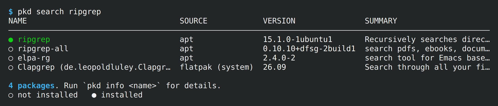
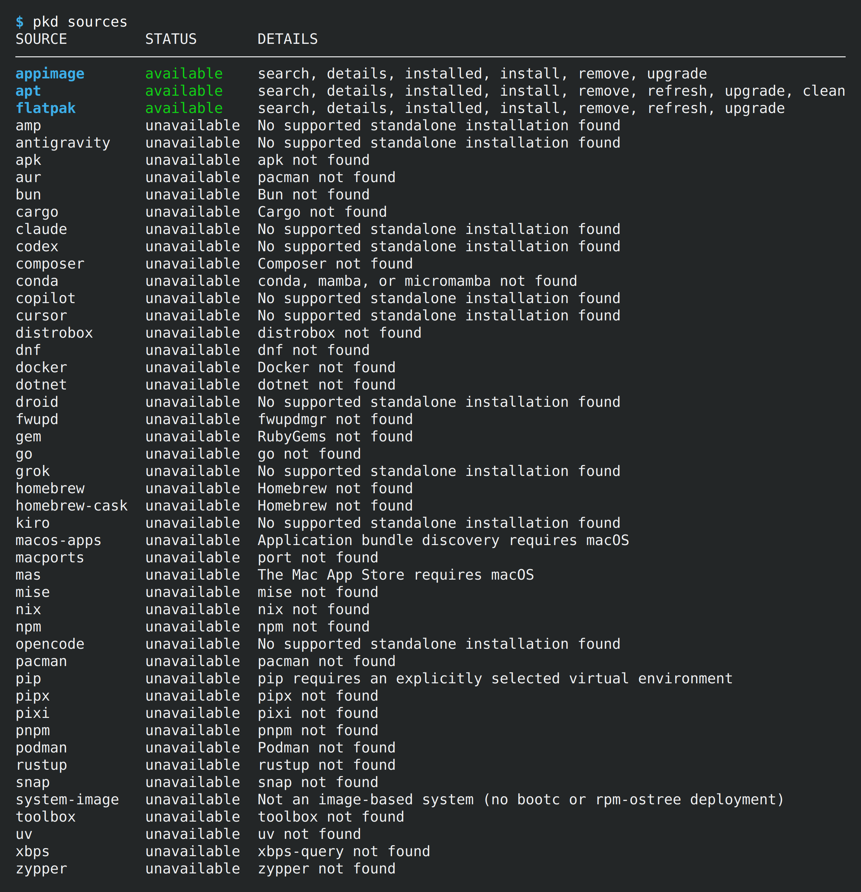
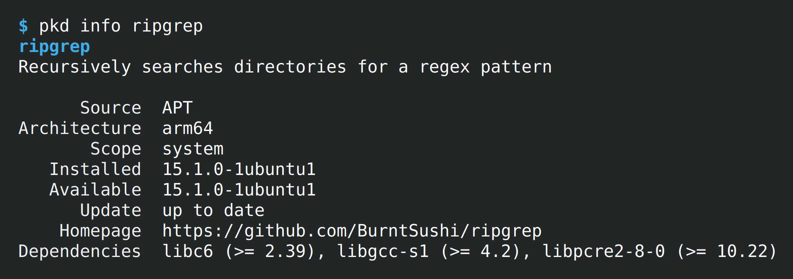

# Command line (`pkd`)

`pkd` is PkgDeck's command-line tool. It uses the same engine as the app.
Running `pkd` with no command prints help, with the everyday commands first
and a few examples. Use `pkgdeck` to open the app.

In the Flatpak build, run it with:

```sh
flatpak run --command=pkd io.github.astrovm.PkgDeck
```



## Quick reference

```sh
pkd sources                              # show package managers and what they support
pkd search neovim --from apt             # search one source
pkd info neovim --from homebrew          # show package details
pkd list --json                          # list installed packages as JSON
pkd install neovim --from apt --yes      # install
pkd remove neovim --from apt --yes       # remove
pkd refresh                              # check for updates and list them (installs nothing)
pkd upgrade neovim --from apt --yes      # install the update found for one package
pkd upgrade                              # install every update found
pkd update                               # check for updates, then install them
pkd clean                                # list cleanup tasks
pkd inspect git                          # find which package provides a command
pkd audit                                # find apps installed more than once
pkd doctor                               # check that PkgDeck can reach your package managers
pkd completions bash                     # print a shell completion script
```

`pkd upgrade` installs the updates PkgDeck already knows about and never
checks for new ones. Run `pkd refresh` first, or `pkd update` to do both.

## Global options

| Option | Meaning |
| --- | --- |
| `--from SOURCE` | Only use this source. Repeat it to pick several. `pkd sources` lists them. |
| `--arch ARCH` | Pick a package architecture, such as `amd64` or `i386` for APT. |
| `--scope user\|system` | Pick the user or system installation. |
| `--yes`, `-y` | Approve changes without asking. |
| `--auth sudo\|polkit` | How to get permission for system changes. Default: `sudo`. |
| `--json` | Print machine-readable JSON. See [JSON output](#json-output). |

Sources for `--from`: `fwupd`, `apt`, `dnf`, `pacman`, `aur`, `zypper`, `apk`,
`xbps`, `snap`, `system-image`, `homebrew`, `homebrew-cask`, `macos-apps`,
`mas`, `macports`, `appimage`, `flatpak`, `docker`, `podman`, `toolbox`, `distrobox`, `cargo`,
`rustup`, `go`, `dotnet`, `npm`, `pnpm`, `bun`, `pip`, `pipx`, `uv`, `mise`, `pixi`,
`conda`, `nix`, `composer`, `gem`, `oh-my-zsh`,
`codex`, `claude`, `grok`, `opencode`, `cursor`, `copilot`, `kiro`,
`antigravity`, `amp`, `droid`, `solana`, `anchor`, and `foundry`.

Without `--from`, PkgDeck uses every package manager it finds. Package managers
that aren't installed are skipped. Sources that fail are reported, not
hidden. `pkd sources` lists every source, including unavailable ones and why.
pnpm 11 and later refuse global installs until `pnpm setup` puts their bin
folder on your PATH, so until then pnpm shows as unavailable.



## Searching

Search is case-insensitive and matches part of the name or description.
Results are ranked: exact name, then names that start with the query, then
names that contain it, then description matches. Homebrew searches formula and
cask names only. On Linux, cask search needs Homebrew 6.0 or later and skips
casks that only install on macOS.

`pkd search` also searches the registries of npm (for npm, pnpm and Bun),
Cargo (crates.io), RubyGems and Composer (Packagist) with each manager's own
search command. pnpm and Bun have no search command, so they search the npm
registry through `npm` when it's installed. It needs a network connection; offline, only installed
packages match. PyPI has had no search since 2020, so pip, pipx and uv only
match installed packages. For AI command-line tools, npm, pnpm, Bun, pipx and
uv also offer the exact package when you search the product name:
`copilot` finds `@github/copilot`, `aider` finds `aider-chat`. The offer
installs that package, never a guess from the name.

`pkd info` shows one package's details:



## Choosing packages

`install`, `info`, `remove`, and `upgrade NAME` need the exact package name. No
fuzzy matching or aliases.

- If the same name exists in more than one source, pick one with `--from`.
- `remove` finds an app from macOS Applications by its full path, for example
  `pkd remove /Applications/Example.app --from macos-apps`. `install` and
  `upgrade` never use that source.
- If a source can't do what you asked, such as removing firmware, PkgDeck
  says so before asking you to confirm.
- npm, pnpm, Bun, Cargo, RubyGems, Composer, pip, pipx and uv install any
  name their registry has, and a registry name alone doesn't prove it's the
  package you mean (npm has an unrelated `ripgrep`). So for exact names
  PkgDeck only confirms what's already installed there. They never make a
  name ambiguous: if another source has the package, PkgDeck uses it and says
  which of them may also have it, for example "npm may also have this name.
  To use it instead, add --from npm." If only they could have it, `install`
  tries the one that can. If nothing matches, the error names them: "No
  package named X was found. PkgDeck can't confirm names in npm and pipx, but
  they can try to install it by name: add --from npm or --from pipx."
- Use `--arch` to choose between APT architectures.
- If a Flatpak is installed for both User and System, add `--scope`:
  `pkd --from flatpak --scope system install org.example.App`
- Homebrew tap packages keep their full name, such as `owner/tap/formula`. PkgDeck
  uses the `brew` found in your `PATH`.
- mise only covers its global tools, the ones `mise use --global` adds. Project
  files such as `mise.toml` and `.tool-versions` are never read or changed.
  `install` adds the tool at `latest`, `upgrade` stays within the version your
  global config asks for, and `remove` also deletes versions no project still
  uses. Search covers mise's registry, including tool aliases.
- pixi covers `pixi global` environments, one per installed tool. `install`
  creates one for an exact conda-forge package, `upgrade` stays within the
  version the global manifest records, and `remove` uninstalls the environment.
  Project workspaces are never read or changed.
- conda uses conda, mamba, or micromamba, whichever it finds first. It lists the
  packages you asked for in the base environment and in each named environment
  (those in an `envs` folder), not their dependencies. It updates them after
  a dry-run solve, and `remove` runs the manager's own `remove` in that
  environment, which keeps the environment itself. Install them with the
  manager. Project prefixes elsewhere are left alone.
- rustup lists each installed toolchain, plus a separate `rustup` row for
  rustup itself. Channels (`stable`, `beta`, `nightly`) update within their
  channel; pinned versions such as `1.85.0` never show updates. Search offers a
  channel or version that isn't installed yet. `install` adds a toolchain with
  the minimal profile. Toolchain installs and updates pass `--no-self-update`,
  so only the `rustup` row updates rustup (`rustup self update`). The default
  toolchain can't be removed; pick another default with `rustup default` first.
- nix covers your user profile (`nix profile`), never NixOS or Home Manager
  configuration. It needs the version 3 profile format. `install NAME` adds
  `nixpkgs#NAME`; searching offers that exact attribute instead of searching
  all of nixpkgs. Versions come from store paths and are for display only:
  whether an upgrade changes anything depends on evaluating the flake, so Nix
  rows never show an update and `pkd upgrade` without names skips them. Run
  `pkd upgrade NAME --from nix` to upgrade one. Entries installed from a store
  path have no flake to upgrade from, so upgrading them is refused.
- If a source fails to answer, PkgDeck won't guess which package you meant.
  Retry, or pick a working source with `--from`.

You can pass several names at once. PkgDeck finds every package before
changing anything, then runs each change in order. If one fails, earlier
changes are kept.

## Updating

`pkd refresh` checks for updates. It refreshes package lists (`apt update`,
`brew update`, `dnf makecache`, `port selfupdate`, and so on), and fetches the
update information of sources without a list: a `softwareupdate` scan for
macOS updates, and a `git fetch` for Oh My Zsh. Each source fetches once;
Homebrew's refresh is its fetch. Then it lists the updates it found. It never
installs anything.

`pkd upgrade` without names updates every installed package that has an
update. `--from` and `--arch` narrow it down. It uses what the last refresh
found and never fetches, like `pkd list`. Without a recent refresh it can
miss an update, or install a version older than the newest one. Run
`pkd refresh` first, or use `pkd update`.

`pkd update` is `pkd refresh` followed by `pkd upgrade`, with the same names
and options (`pkd update neovim`, `--allow-removals`) and one review for the
upgrade. If a source can't refresh, `pkd update` without names stops before
changing anything. With names, it refuses only packages from that source,
since its old information could hide the new version.

## Confirmation and passwords

In a terminal, PkgDeck shows what it will change and asks before doing it.
While it works, a spinner shows the current step, and each change gets a
✓ or ✗ line as it finishes. In scripts, or with `--json`, you must pass `--yes`
to install, remove, upgrade, update, or clean. Otherwise the command stops with
exit code 2 before doing anything.

`pkd refresh` installs nothing, so it never asks. It skips refreshing package
managers that don't keep package lists, such as npm or Cargo: they check for
updates whenever they list packages. `pkd update` asks once, before upgrading.

Approving a change doesn't give PkgDeck admin rights, and PkgDeck never reads
your password:

- `--auth sudo` (default): if a change needs admin rights and `sudo` has no
  cached login, `sudo` asks for your password in the terminal before the
  changes start. In scripts, it only works with a cached login or a
  password-free rule.
- `--auth polkit` uses your desktop's password prompt.

The desktop app has no such option: it always uses the system password prompt.

Homebrew always runs as your user.

### APT

- Installs and single-package upgrades never remove other packages.
- A full upgrade (`pkd upgrade` with APT) does a dry run first and shows every
  update, install, and removal. It checks the plan again right before running.
- If the upgrade would remove packages, review the list and add
  `--allow-removals`. `--yes` alone never approves removals.
- `pkd remove` behaves like normal APT removal.

### Homebrew

Homebrew keeps its own dependency checks, locks, and tap rules. `pkd remove`
runs `brew uninstall --force --formula`, which removes every installed version
of that formula, following
[Homebrew's documented behavior](https://docs.brew.sh/FAQ#how-do-i-uninstall-a-formula).
It never skips dependency checks. Homebrew's automatic update and cleanup are
turned off during package changes. `pkd refresh` still refreshes Homebrew.

### Docker and Podman

Docker and Podman list your local images. Each image is identified by its
image ID. Docker images are system-wide, while Podman images belong to your
user.

```sh
pkd --from docker upgrade IMAGE_ID                         # pull the image's tag again
pkd --from docker install registry.example/team/image:tag  # pull a new image
pkd --from docker remove IMAGE_ID                          # remove an image
```

Replace `docker` with `podman` for Podman. Registry images only show up when
exactly one container source is selected, so normal searches don't return
container results. PkgDeck never force-removes images used by containers and
never deletes volumes. A tag isn't marked as updated unless the registry is
actually checked.

### Cancelling

Ctrl+C cancels reads and pending changes. If a package manager is already
making changes, it finishes first. The result then shows
`cancellation_deferred`. After a batch with failures, check each result.

## Cleaning up

```sh
pkd clean                     # list cleanup tasks (changes nothing)
pkd clean apt:autoremove      # run one task
pkd clean --all               # run every task
```

Each task has a key like `apt:autoremove` and a preview from the package
manager itself. Running a task uses the same confirmation, permission, and
cancellation rules as other changes. PkgDeck checks the task again right
before running it.

| Source | What it cleans |
| --- | --- |
| APT | Unused dependencies and old downloaded packages |
| Homebrew | Unused dependencies and old downloads |
| Docker, Podman | Untagged images |
| Docker Buildx | Unused build cache |
| npm, pip, uv | Download caches |

- Volumes are never cleaned.
- pip needs a virtual environment, like its other commands.
- pnpm, the Podman build cache, and unused Flatpak runtimes aren't offered,
  because their package managers can't show an exact preview.
- Listing APT tasks doesn't need a password. The list only counts cached
  downloads. APT decides which ones are old when the cleanup runs.

## Inspecting your system

`pkd inspect COMMAND` shows which file runs when you type `COMMAND` and which
package installed it. It searches your `PATH` in order, shows other matches
and symlink targets, and asks your package managers who owns each file:
the APT, RPM and Pacman databases, and the folders only one manager writes to
(Homebrew's Cellar and Caskroom, Cargo's install records, pipx venvs, uv tools,
mise installs). It never runs the command.

Each file says who installed it, such as "Installed by cowsay (APT)", then
the matching package, such as "Package: cowsay from APT, system".

- "No package manager claims PATH" means no package manager owns the file.
- "APT lists PATH under NAME, but NAME isn't in the installed list" means a
  package manager claims the file, but PkgDeck can't match it to an
  installed package.
- `--json` includes the full package ID.

`pkd audit` shows apps installed more than once. Copies are grouped only when
they share an AppStream ID or homepage, and versions aren't compared across
package managers. It also lists leftover config files that dpkg recorded for
removed packages. PkgDeck doesn't scan your home folder or guess leftovers.
Use `--from` and `--scope` to narrow the report.

## Exporting your software list

```sh
pkd inventory export software.json               # every installed package
pkd --from apt inventory export apt.json bash    # one package
pkd inventory preview software.json              # check the list on this machine
```

The export is a versioned JSON file with package names, sources, and scopes.
It doesn't include passwords, scripts, user IDs, or paths. Export never
overwrites an existing file.

`preview` checks each entry on the current machine. It reports whether it's
installed, installable, unavailable, unsupported, or ambiguous, without
changing anything. Recorded versions are for reference only. Installing from
an inventory isn't supported yet.

An inventory file can be up to 8 MB and list up to 20,000 packages. Problems
are reported in one sentence, such as "Can't open software.json: no such
file." or "software.json already exists. PkgDeck never overwrites a file;
choose a new name."

## Repositories

```sh
pkd repos                                         # list repositories
pkd repos list --from flatpak --scope system
pkd repos add example https://example.org/example.flatpakrepo --from flatpak --scope user
pkd repos disable example --from flatpak --scope user
pkd repos enable example --from flatpak --scope user
pkd repos priority example 10 --from flatpak --scope user   # 0 to 9999, higher wins
pkd repos remove example --from flatpak --scope user
pkd repos edit --from apt                         # open Software Sources
pkd repos enable lvfs --from fwupd
```

Changes need exactly one `--from` and a confirmation (or `--yes`). Flatpak uses
User by default. Add `--scope system` for system repositories. Removing a
Flatpak repository doesn't force-remove apps installed from it. Repositories
keep their normal signature checks.

## Firmware

If `fwupdmgr` is installed, `pkd upgrade` includes firmware updates.

```sh
pkd list --from fwupd                    # list devices
pkd upgrade --from fwupd                 # update all firmware
```

To update one device, use the device ID from `pkd list --from fwupd --json`.
Power and restart requirements are shown before you confirm. PkgDeck never
restarts your computer, downgrades firmware, or forces an update.

## Toolbx and Distrobox containers

```sh
pkd list --from toolbox
pkd info fedora-toolbox-43 --from distrobox
pkd upgrade fedora-toolbox-43 --from toolbox
pkd remove old-box --from distrobox
```

On image-based systems such as Fedora Silverblue, development tools live
inside Toolbx and Distrobox containers. Each source lists the containers its
tool made (a container never appears under both), with the image and whether
it is running; details also name the apps and commands a Distrobox container
exports to the host. Updating a container upgrades the packages inside it:
Distrobox runs `distrobox upgrade`, and Toolbx runs the container's own
package manager (dnf, apt, pacman, zypper, apk or XBPS) through
`toolbox run`. That starts a stopped container. If sudo inside a Toolbx
container asks for a password, update it from a terminal with
`toolbox enter`. Update status stays unknown, so `pkd upgrade` without names
leaves them alone.

`pkd remove` deletes a container with `toolbox rm --force` or
`distrobox rm --force`, even while it runs, and everything installed in it
goes with it. Your home folder is shared with the host and stays. Distrobox
also deletes the apps and commands the container exported. PkgDeck never
creates containers.

## Image-based Linux systems

```sh
pkd list --from system-image
pkd info system --from system-image
pkd upgrade --from system-image
pkd remove htop --from system-image
```

On Fedora Atomic desktops, CoreOS, and other bootc or rpm-ostree systems, the
`system-image` source shows one row, `system`, for the whole OS. It reads
`bootc status` first and falls back to `rpm-ostree status`. Details list the
running deployment, the one waiting for a restart, the rollback, and layered
packages.

`pkd upgrade` runs `bootc upgrade` or `rpm-ostree upgrade`, which downloads a
new deployment that applies on the next restart. PkgDeck never restarts your
computer. If an update is already waiting for a restart, it does nothing and
says so. Ordinary systems report the source as unavailable.

Packages layered on top of the image with `rpm-ostree install` get a row of
their own, from the deployment the next restart uses. They update along with
the system, so they can't be updated on their own. `pkd remove` runs
`rpm-ostree uninstall`, which also makes a new deployment: the package is gone
after the next restart. The `system` row itself can't be removed.

## Arch User Repository (AUR)

```sh
pkd list --from aur
pkd info yay --from aur
pkd remove yay --from aur
```

The `aur` source lists installed packages that Pacman's repositories don't
have (`pacman -Qm`) and checks them against the AUR's current versions, using
Pacman's own version order. Pacman no longer lists these packages, so each
appears once. Details show the AUR version, maintainer, and whether it's
flagged out of date. Packages missing from the AUR are shown as built locally
or removed from the AUR.

In June 2026 malicious commits reached about 1,500 AUR packages, and building
one runs its PKGBUILD. PkgDeck never builds one itself: `pkd upgrade` runs
your AUR helper (paru, then yay), and its preview links the PKGBUILD's change
history so you can review it first. It never installs AUR packages. Search
only matches installed AUR packages.

`pkd remove` builds nothing, so it needs no helper: it runs `pacman -Rns`,
exactly as the Pacman source removes a package, with the same password
prompt.

If Pacman's repository databases aren't synced, every package looks foreign,
so the source reports an error instead: run `pkd refresh --from pacman`. When
the AUR can't be reached, packages are still listed with unknown updates.

## apk, XBPS, and MacPorts

`apk` (Alpine), `xbps` (Void), and `macports` work like the other system
package managers: search, list, install, remove, update, and refresh. Updates
come from `apk list --upgradable`, `xbps-install -Mun`, and `port outdated`,
which only report. Changes need admin rights and always run the manager from
its fixed location (`/sbin` or `/usr/sbin` for apk, `/usr/bin` for XBPS,
`/opt/local/bin/port` for MacPorts), never whatever `PATH` finds first.

- MacPorts keeps each port's variants when it upgrades. Only active ports are
  listed; inactive versions stay installed but aren't rows. `pkd refresh` runs
  `port selfupdate`. The Mac app adds `/opt/local/bin` to its `PATH`, so it
  finds MacPorts when started from Finder.
- Local package files aren't supported for these three.

## macOS updates

```sh
pkd list --from macos-updates
pkd upgrade --from macos-updates    # every pending update
pkd upgrade "Safari" --from macos-updates
```

The `macos-updates` source lists what `softwareupdate --list` reports:
macOS point releases, Safari, the Command Line Tools and the like.
`pkd refresh` and `pkd update` ask Apple's servers; other commands, `pkd
upgrade` included, read the last check (`--no-scan`). Updates run `/usr/sbin/softwareupdate` as root, so `pkd` asks
for your password first. An update that needs a restart is only downloaded:
finish it from System Settings > General > Software Update. `pkd` never
restarts your Mac, and upgrades to a new major version of macOS aren't listed.

Before a change that needs sudo on macOS (MacPorts, macOS updates, App Store
updates, and Homebrew casks, whose installers may run sudo), `pkd` asks for
your password once in the terminal. The tools it runs reuse that sudo login.

## Mac App Store apps

```sh
pkd list --from mas
pkd info Keynote --from mas
pkd upgrade --from mas              # update every App Store app with an update
pkd upgrade Keynote --from mas
pkd remove Keynote --from mas       # move it to the Trash
```

The `mas` source uses [mas](https://github.com/mas-cli/mas) 7 or newer
(`brew install mas`) to list apps installed from the App Store and check them
for updates. The check compares versions with the App Store catalog and never
starts a download. Name an app by its name or its App Store ID.

Updates run `mas update`. mas asks for your Mac password through sudo, which
needs a terminal, so update from `pkd` in Terminal or from the App Store app;
`pkd` asks for it before mas starts.
You must be signed in to the App Store. PkgDeck checks that each app's version
changed afterwards. It never installs App Store apps.

Removing an app moves its bundle to your Trash (`~/.Trash`), where you can put
it back. App Store apps belong to root, so PkgDeck moves them with the system's
`/bin/mv` as root: `pkd` uses an existing sudo login (`sudo -n`), the Mac app
shows the macOS administrator password dialog. The app stays owned by root in
the Trash, like one Finder moved there. PkgDeck doesn't run `mas uninstall`,
because that needs sudo's terminal prompt. Before moving, PkgDeck checks that
the App Store receipt is in the bundle and that the app isn't open; afterwards
it checks that the bundle left and that `mas list` no longer shows it there.
It refuses to run as root, since root's Trash isn't yours.

## macOS application inventory

```sh
pkd list --from macos-apps
pkd list --from macos-apps --json
pkd info '/Applications/Visual Studio Code.app' --from macos-apps
pkd remove '/Applications/Visual Studio Code.app' --from macos-apps
```

This source scans `/Applications` and `~/Applications`. The exact
bundle path is the package name and reference, so two copies keep separate
identities. Details include location, observed version/build, Homebrew ownership
evidence, and curated cask candidates for VS Code, Firefox, and Obsidian.
Candidates are matched by bundle identifier, not by filename. On their own they
do not verify publisher or release channel. App Store copies with receipts
receive no cask suggestion.

### Letting Homebrew manage an app you installed

```sh
pkd install --from homebrew-cask visual-studio-code
```

When VS Code, Firefox or Obsidian is already in `/Applications`, installing its cask hands
that copy to Homebrew (`brew install --cask --adopt`) instead of failing. The app
stays where it is. Before running Homebrew, PkgDeck checks that the copy:

- is signed by the expected publisher (Microsoft, Mozilla or Dynalist) and the signature verifies,
- is the stable edition (by bundle identifier), didn't come from the App Store,
  runs natively on this Mac, and isn't older than the cask,
- leaves every place the cask writes to free, or already linked to this app.

If any check fails, nothing changes and PkgDeck says why. Homebrew undoes a
failed adoption by deleting the app, so PkgDeck keeps an instant APFS copy until
Homebrew finishes and puts the app back if it went missing. Other apps aren't
adopted. After adoption, removing the cask removes the app, as
for any cask.

Ownership covers the active Homebrew prefix and requires an installed app-artifact
symlink to the exact bundle. Failed checks stay unknown. Missing ownership
records do not prove that an app is unmanaged. Apps with unreadable metadata
remain visible, with an unknown version. Architecture and update status are
unknown in this first inventory implementation. This source itself can't
install or update; adoption runs through the cask, as above. On other platforms the source reports that macOS is
required.

### Removing an app

`pkd remove <bundle path> --from macos-apps` takes the app off the Mac, by
what the inventory knows about it:

- **Managed by Homebrew:** `brew uninstall --cask` for its cask, which deletes
  the app as removing the cask would.
- **Anything else you own**, in a folder you can change: `/usr/bin/trash` moves
  it to your Trash, with no prompt.
- **Anything else** (App Store apps belong to root): the system's `/bin/mv`
  moves it into your Trash as root, after `sudo -n` in `pkd` or the macOS
  administrator password dialog in the Mac app. Cancel changes nothing.

PkgDeck refuses, with the reason, apps that come with macOS (anything on the
system volume, such as Safari through its alias in `/Applications`, or guarded
by System Integrity Protection), aliases, open apps, apps whose Homebrew records
couldn't be checked, and apps two casks claim. Right before removing it re-reads
the bundle: if the bundle at that path changed identity since it was listed,
nothing happens. Afterwards it checks that the bundle is gone. A second app with
the same name in the Trash is kept; the new one gets a number (`Name 2.app`). See the [GUI guide](gui.md#macos-application-inventory) for scan limits.
Unreadable subfolders produce a partial inventory: readable apps remain listed,
and source errors identify the skipped folders (also in JSON `failures`).

## Standalone CLI tools

PkgDeck finds Codex, Claude Code, Grok, OpenCode, Cursor CLI, GitHub Copilot
CLI, Kiro CLI, Antigravity CLI, Amp, and Factory Droid when they were installed
with their official installers. They appear in `pkd list` and `pkd upgrade`.
So do the blockchain toolchains the [Anchor](https://www.anchor-lang.com/docs/installation)
and [Foundry](https://getfoundry.sh/introduction/installation) guides install:
the Solana CLI (Agave), Anchor through AVM, and Foundry (forge, cast, anvil
and chisel). Rust comes from the `rustup` source, and Node.js and Yarn from
Homebrew or npm. Node.js versions installed with nvm aren't covered.

```sh
pkd list --from codex --json
pkd info codex --from codex
pkd upgrade codex --from codex
pkd upgrade --from claude --from grok --from opencode
pkd remove codex --from codex
```

PkgDeck updates and removes these tools. It can't install them. Copies
installed with npm or Homebrew are handled by that package manager. The
program must be owned by you and installed in the official location:

| Tool | Location | Overrides |
| --- | --- | --- |
| Codex | `~/.local/bin/codex`, linking into `~/.codex/packages/standalone/releases` | `CODEX_HOME`, `CODEX_INSTALL_DIR` |
| Claude Code | `~/.local/bin/claude`, linking into `~/.local/share/claude/versions` | `XDG_DATA_HOME`; `CLAUDE_CONFIG_DIR` for the update channel |
| Grok | `~/.grok/bin/grok`, linking into `~/.grok/downloads` | `GROK_BIN_DIR` |
| OpenCode | `~/.opencode/bin/opencode` | |
| Cursor CLI | `~/.local/bin/agent` or `cursor-agent`, linking into `~/.local/share/cursor-agent/versions` | |
| GitHub Copilot CLI | `~/.local/bin/copilot`, reporting itself as GitHub Copilot CLI | |
| Kiro CLI | `~/.local/bin/kiro-cli`, reporting itself as kiro-cli (Linux; on macOS the installer ships an app) | |
| Antigravity CLI | `~/.local/bin/agy` | |
| Amp | `~/.amp/bin/amp` | `AMP_HOME` |
| Factory Droid | `~/.local/bin/droid` | |
| Solana CLI (Agave) | `~/.local/share/solana/install/active_release/bin/agave-install`, linking into its `releases` folder, with the release channel in `~/.config/solana/install/config.yml` | |
| Anchor (AVM) | `~/.avm/bin/avm`, with the active Anchor named in `~/.avm/.version` and installed as `~/.avm/bin/anchor-VERSION` | `AVM_HOME` |
| Foundry | `~/.foundry/bin/forge`, linking into `~/.foundry/versions`, next to `foundryup` | `FOUNDRY_DIR` |

How updates are checked and installed:

| Tool | Checks with | Updates with |
| --- | --- | --- |
| Codex | Latest stable release | Official installer, run from a private temporary folder |
| Claude Code | Your configured stable or latest channel | `claude update` |
| Grok | `grok update --check --json` | Grok's own updater |
| OpenCode | Latest stable release | `opencode upgrade VERSION --method curl` |
| Cursor CLI | The release named by Cursor's installer | `agent update` |
| GitHub Copilot CLI | Latest stable release | `copilot update` |
| Kiro CLI | Kiro's stable release manifest | `kiro-cli update --non-interactive` |
| Antigravity CLI | Antigravity's release manifest for your platform | `agy update` |
| Amp | Amp's published CLI version | `amp update` |
| Factory Droid | The release Droid's installer names | `droid update` |
| Solana CLI (Agave) | The release on your channel (stable, beta or edge). A pinned release (`agave-install init VERSION`) is never updated | `agave-install update` |
| Anchor (AVM) | Latest stable Anchor release | `avm install VERSION`, which also switches to it. AVM also rebuilds its `solana-verify` helper from source, so this takes a few minutes |
| Foundry | Latest stable release. Nightly builds aren't checked | `foundryup --install stable` |

`curl` is needed for the release checks and the Codex installer. If a check
fails, it's reported as an error, never as "up to date". Updates need
confirmation, run without admin rights, and never downgrade a newer version.
PkgDeck checks the version after updating. Restart open sessions of the tool
to use the new version.

Removing a tool takes away only what its installer put there. Your settings,
sign-ins and keys stay:

| Tool | Removes | Keeps |
| --- | --- | --- |
| Codex | `~/.local/bin/codex` and `codex-code-mode-host`, `~/.codex/packages/standalone` | The rest of `~/.codex`: settings, sign-in and history |
| Claude Code | `~/.local/bin/claude`, `~/.local/share/claude` | `~/.claude` and `~/.claude.json` |
| Grok | The `grok` and `agent` links in `~/.grok/bin` and `~/.local/bin`, `~/.grok/downloads` | The rest of `~/.grok`, including your sign-in. Links the installer made in `/usr/local/bin` are left for you to remove |
| OpenCode | `~/.opencode/bin` | The rest of `~/.opencode` (plugins) and `~/.config/opencode` |
| Cursor CLI | `~/.local/bin/agent` and `cursor-agent`, `~/.local/share/cursor-agent` | `~/.cursor` |
| GitHub Copilot CLI | `~/.local/bin/copilot` | `~/.copilot` |
| Kiro CLI | `~/.local/bin/kiro-cli` and `kiro-cli-chat` | Kiro's settings |
| Antigravity CLI | `~/.local/bin/agy` | Antigravity's settings |
| Amp | `~/.amp/bin`, the installer's download checks in `~/.amp`, and the `~/.local/bin/amp` link | `~/.config/amp` |
| Factory Droid | `~/.local/bin/droid` | `~/.factory` |
| Solana CLI (Agave) | `~/.local/share/solana/install`, with every installed release | `~/.config/solana`: your keypairs and the CLI and installer settings |
| Anchor (AVM) | In `~/.avm`: `bin` (avm, anchor, every `anchor-VERSION` and `solana-verify`), `.version`, and Cargo's records of AVM (`.crates.toml`, `.crates2.json`) | Your Anchor projects |
| Foundry | `~/.foundry/bin`, `~/.foundry/versions` and `~/.foundry/share/man` | `~/.foundry/keystores` (cast wallets) and `~/.foundry/cache` |

The same overrides as above apply. Folders left empty are removed too. On
macOS everything goes to the Trash, so you can put it back; on Linux it's
deleted. A launcher is removed only while it still points into the tool's own
folder, so a link another tool took over stays. PkgDeck refuses to remove a
folder that is a link to somewhere else, isn't yours, or holds your home
folder. Removal needs confirmation, runs without admin rights, and PkgDeck
checks afterwards that the tool is gone. Lines the installer added to your
shell setup (`~/.zshrc`, `~/.bashrc`) stay; remove them yourself if you like.

Official docs: [Codex](https://learn.chatgpt.com/docs/codex/cli),
[Claude Code](https://code.claude.com/docs/en/setup),
[Grok](https://docs.x.ai/build/enterprise),
[OpenCode](https://opencode.ai/docs/cli/#upgrade).

## Output

- Sources are named the way their projects name them ("APT", "Flatpak",
  "Homebrew"), except in `--from` values and the SOURCE column, which keep
  the ids you type.
- Flatpak apps show their app name, with the app ID after it:
  "VLC (org.videolan.VLC)".
- `info` says "Installed  no", "Update  up to date", or
  "Update  available (2.0)".
- On narrow terminals, `flatpak (system)` shortens to `flatpak·sys`, and
  `pkd sources` moves DETAILS onto an indented line below each source.
- The legend under a package list only explains the markers it uses.
- APT repositories are named by host and suites, such as
  "deb.debian.org · bookworm, bookworm-updates".
- When a package manager fails, the error is one sentence with its most
  useful line, such as "APT exited with code 100: E: Unable to locate
  package x". `pkd sources` shows such sources as "failed", with the reason.
- PkgDeck refuses to make changes as root: "PkgDeck can't make changes when
  it runs as root. Run it as your normal user; it asks for permission when
  needed."

## Shell completion

```sh
pkd completions bash > ~/.local/share/bash-completion/completions/pkd
pkd completions zsh > ~/.zfunc/_pkd     # a folder in your fpath
pkd completions fish > ~/.config/fish/completions/pkd.fish
```

## Cache

To answer faster, PkgDeck keeps some answers in `$XDG_CACHE_HOME/pkgdeck`
(or `~/.cache/pkgdeck`). The app and `pkd` share it. It keeps:

- APT search and list results, and APT's app data (DEP-11) for matching apps
- Flatpak search results
- Homebrew's installed formula and cask listings, and the package details
  searches read
- Pacman search results
- Each standalone tool's version, such as OpenCode's

An entry is used only while what it depends on is exactly as it was when it
was saved:

- APT: the package lists, the package database, the app data, the helper and
  your locale
- Homebrew: the installed kegs and casks, your taps, the cask and formula data
  `brew update` fetched, and Homebrew itself
- Pacman: the synced databases, the installed packages and `pacman.conf`
- Standalone tools: the tool's program file

Any change there, and any change PkgDeck makes, discards it. Only successful,
complete answers are saved, readable only by you. Set `PKGDECK_NO_CACHE=1` to
turn it off. It's never used when running as root.

## JSON output

With `--json`, `pkd` prints exactly one JSON document to stdout. Progress goes
to stderr.

```json
{"schema_version":1,"exit_code":0,"data":{"packages":[],"failures":[]}}
```

| Command | `data` contains |
| --- | --- |
| `search`, `list` | `packages`, plus `failures` for each source that failed |
| `info` | Package details |
| `sources` | `sources` |
| `clean` | Cleanup `items` and `failures` |
| Changes | `operations`, each with a `result` of `{"Ok":...}` or `{"Err":...}` |
| `refresh` | `operations` (the refreshes), `updates` (packages with an update), and `failures` |
| `update` | Also `refresh`: its `operations`, and `failures` for update information it couldn't fetch |
| Errors | `error`, and a readable `message` when available |
| No match | Also `offers`: sources that could try the name, such as `["npm", "pipx"]` |

- Package IDs have `backend`, `name`, `architecture`, and `scope`, plus remote
  and ref fields when the source needs them.
- Versions are the package manager's own strings. `update` is `unknown`,
  `current`, or `available`.
- If an APT full upgrade would remove packages and `--allow-removals` wasn't
  passed, the error is `apt_removals_require_consent` and includes the `plan`.
- A failed source includes the package manager's own error message when
  available. Run the same command directly in a terminal for full output.
- `doctor` is text-only. `doctor --json` exits with 2. Help, version, and usage
  errors are always plain text.

## Exit codes

| Code | Meaning |
| --- | --- |
| 0 | Success, including no results or no updates |
| 1 | A package manager or other error |
| 2 | Invalid usage, or `--yes` is required |
| 3 | No package with that exact name |
| 4 | More than one match, or a source failed to answer |
| 5 | Permission denied or unavailable |
| 6 | APT is busy (locked by another program) |
| 7 | Cancelled or declined |
| 8 | Some sources failed, or some changes succeeded and others failed |

If every change in a batch fails, the exit code is the first failure's code.
`pkd sources` lists unavailable package managers as normal output. It only
returns 1 if detection itself fails.
