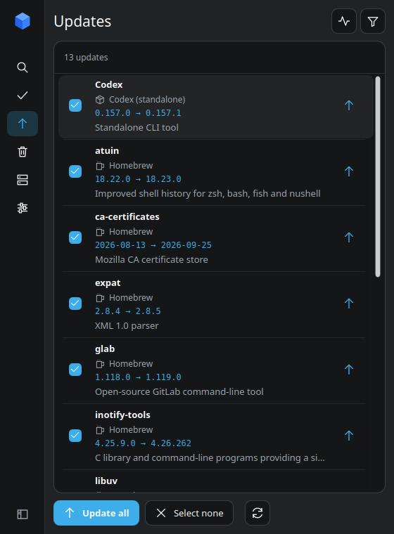
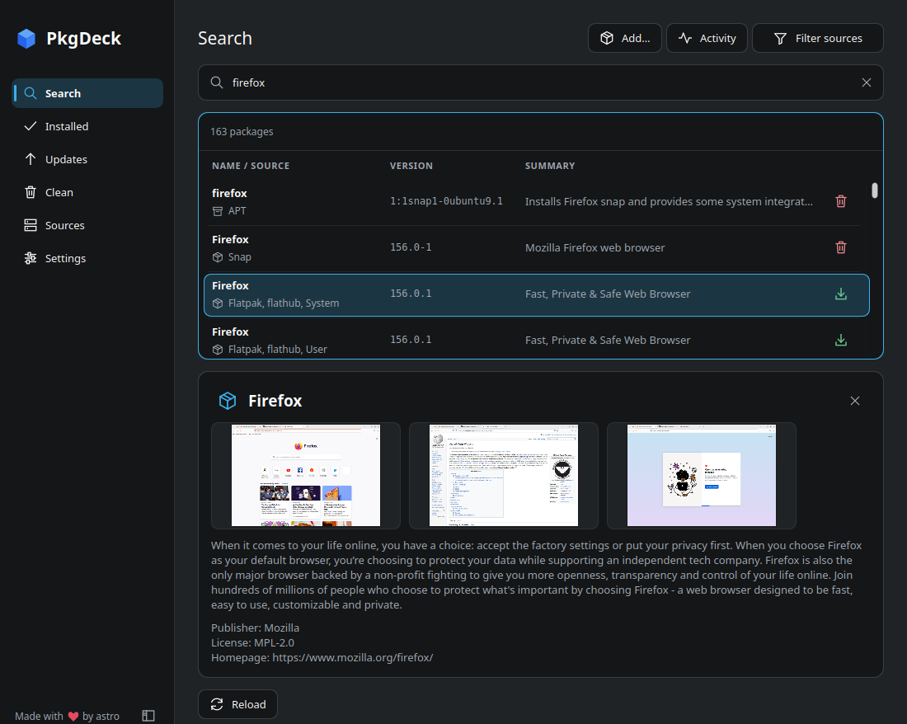
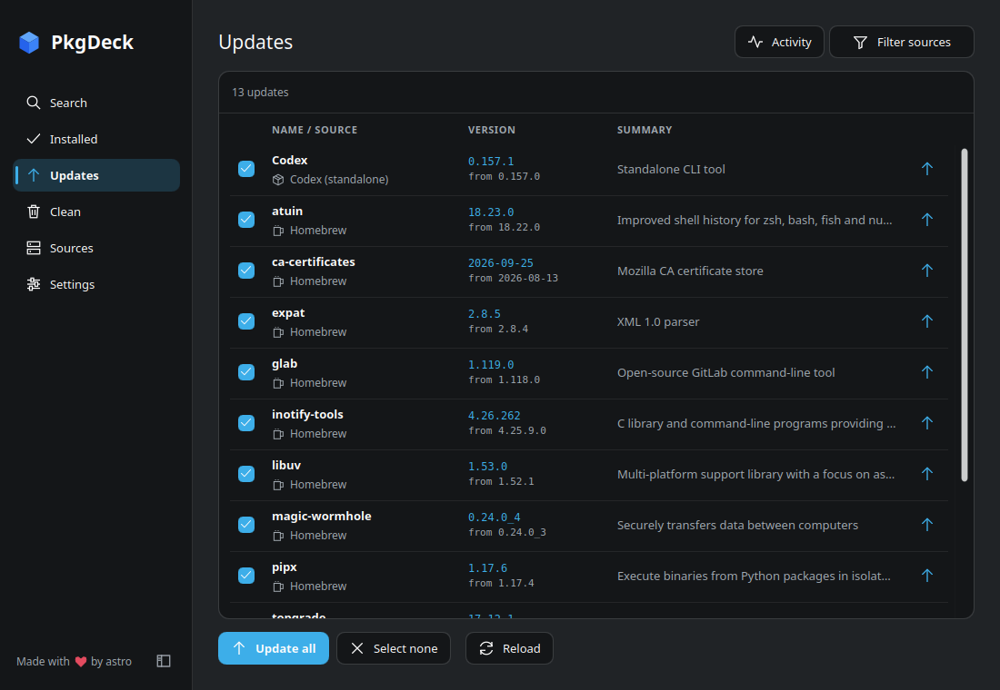
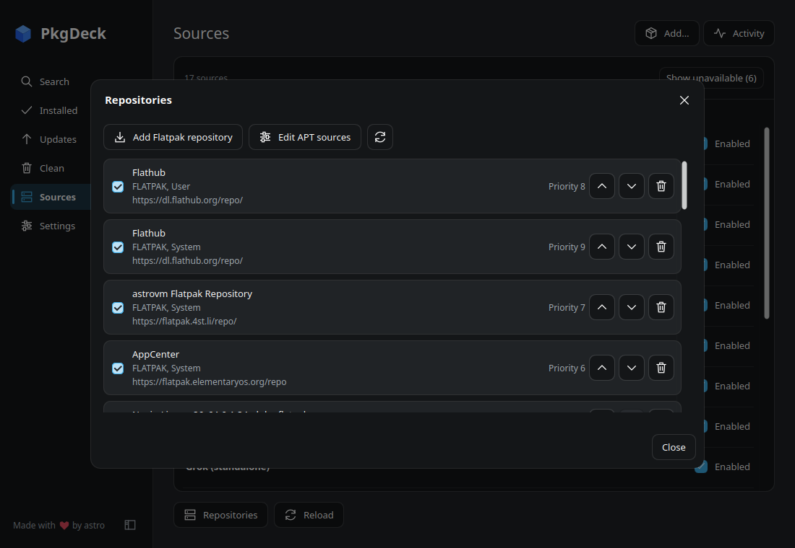

# Using the app

Open PkgDeck from your app menu or run `pkgdeck`. The sidebar has six pages:
**Search**, **Installed**, **Updates**, **Clean**, **Sources**, and **Settings**.
The **Activity** button in the header shows running and finished work.

Drag the sidebar's edge to resize it; drag it narrow to keep only its icons,
or double-click the edge to restore the default width. The button in the
sidebar's bottom corner hides it, and the button left of the page title brings
it back; Ctrl+B does both. In narrow windows the
sidebar shows only icons.

## Search

Type an app or package name. Exact matches come first, and the same app from
different package managers is shown together. Each row keeps its own source,
architecture, and scope (User or System), so you always act on one exact
package. For Flatpak, pick the User or System row to choose where it installs.

- The button on the right of a row installs, removes, or updates that package.
- Click a row to see its description, screenshots, publisher, license,
  homepage, and dependencies, when the source provides them. Close details
  with **×**.
- App names, icons, and screenshots come from the source. Packages without
  app metadata show their package name.

## Open a package file or link

On Search, click **Add…**, drop a file onto the window, or pass a path or link
to `pkgdeck`. If PkgDeck is already open, the file goes to the open window.
PkgDeck always shows a preview first. It never installs anything without your
confirmation.

| Kind | Formats |
| --- | --- |
| Packages | `.AppImage`, `.deb`, `.rpm`, `.pkg.tar.zst` (also `.xz`, `.gz`, `.bz2`, `.lz4`), `.flatpak`, `.flatpakref`, `.snap` with its `.assert` file |
| Repositories | `.flatpakrepo`, `.repo`, `.sources`, `.list`, openSUSE `.ymp` |
| Links | HTTPS links to any of the files above, and `flatpak+https://` links |

What the preview shows:

- AppImage: where the app will be copied, its desktop entry, and whether it
  can update itself. PkgDeck never runs the file to inspect it, and your
  original file is kept.
- Debian package (`.deb`): the changes APT would make, before it asks for
  your password.
- Flatpak reference: the app, its repository, whether a signing key is
  included, and any extra repository it needs. Choose User or System here.
  Flatpak may still download extra runtimes during install.
- RPM, Arch, and Snap files: checked by their own package manager.
- Repository files: checked again right before they are added. `.ymp` files
  open the openSUSE installer.

The file picker only lists formats that some package manager on this
computer can handle.

## Installed

Filter the list by name, or turn on **Duplicate installs** to see apps
installed from more than one source. Grouping is only visual. Each copy stays a
separate package.

These controls work on every package page:

- Click a column heading to sort it. Drag the dividers to resize columns.
- The source picker filters the current page. It also lists sources you can't
  use, with the reason.
- **Reload** gets fresh package data.

Docker and Podman images are shown as separate sources. Each row shows
tags, size, age, and image ID. You can pull a tagged image again or remove it.
Untagged ("dangling") images can only be removed. To pull a new image, select
only Docker or Podman and search for the full image name with its tag.

## Updates

Updates lists package updates and, if `fwupdmgr` is installed, firmware updates.

- Click a row's arrow to update just that item.
- Check several rows and click **Update selected**. When every row is checked,
  the button reads **Update all**.

Versions appear as `installed → new` when the source provides both. Some
Flatpak runtimes only report a branch or commit. PkgDeck shows what the
source reports and never makes up a version.

### Before anything changes

Every change opens a confirmation. It shows the package, source, scope, and
any extra changes the package manager plans to make. **Cancel** is selected by
default.

- APT does a dry run first and checks it again right before making changes.
  For **Update all**, packages that will be installed or removed are listed at
  the top. If the plan changes, the update stops before asking for your
  password.
- Firmware confirmations list power and restart requirements. PkgDeck never
  restarts your computer.
- **Update all** retries sources that failed to check. If a source still
  fails, the confirmation says so and its updates are skipped. The
  rest still work, and **Retry** is available in the error notice.

### Cancelling

Cancel stops work that hasn't started yet. If a package manager is already
making changes, PkgDeck lets it finish first. Finished changes are not undone
if a later step fails. Click **Reload** to see the current state.

## Clean

Clean lists maintenance tasks, such as removing unused dependencies or cached
downloads. Open a task to see exactly what it will remove, or click
**Clean all**. Every task asks for confirmation, and PkgDeck checks the task
again right before running it. Sources that can't clean are not listed, and
checks that failed are shown separately.

APT finds unused dependencies without a password. It only counts cached
downloads at this stage. APT picks which cached downloads to delete when the
cleanup runs, and asks for your password then.

## Sources

Turn package managers on or off. PkgDeck remembers your choice.

The source picker filters one page. The Sources page chooses which package
managers PkgDeck checks at all. Neither one turns repositories on or off.
**Refresh sources** downloads the latest package lists for the selected
package managers.

### Repositories

Open **Sources → Repositories** to see and manage repositories.

| Package manager | What you can do |
| --- | --- |
| Flatpak | Add, remove, enable, disable, and reorder repositories, for User and System separately |
| APT | View sources; **Edit APT sources** opens your distro's Software Sources tool when it's installed |
| DNF and Zypper | View repositories; open `.repo` files to add them |
| Pacman | No repository editing; open local package files |
| Firmware (Linux) | Enable or disable firmware repositories |
| Homebrew (macOS) | No repository editing; manage formulae and casks from the package pages |

If a Flatpak system installation is read-only, it's shown without edit
controls. Controls that can't work on this computer are hidden. Repository
changes use the package manager's normal signature checks and password prompt.

### Standalone CLI tools

Codex, Claude Code, Grok, and OpenCode installed with their official
installers show up in Installed and Updates. PkgDeck updates them with their
own updaters, without admin rights. It can't install or remove them. Copies
installed with npm or Homebrew are managed by that package manager instead.
See [supported install layouts](cli.md#standalone-cli-tools).

## Update notifications

Turn on **Background checks** in Settings to check for updates while PkgDeck
is running.

- The first check runs about 30 seconds after launch, then at most every 30
  minutes.
- Checks wait while you're offline, on a metered connection, or while another
  package operation is running.
- On Linux, **Start in background at login** keeps checks running after you
  log in.
- Click the tray icon to show or hide the window. Its menu has **Check now**
  and **Quit**. Clicking a notification opens Updates.

You get one notification for each new batch of updates, including on the first
check. PkgDeck remembers what it already told you about, even after a restart.
If one source fails, updates from the other sources still trigger a
notification.

Settings shows when the last check ran, how many updates it found, and
whether your desktop supports notifications. **Test
notification** sends a sample message.

## Performance

PkgDeck shows saved results right away, for up to 60 seconds, and marks them
as saved. Older results stay on screen, whole, until fresh ones finish
loading. Installed, Updates, and Clean load in the background after you leave
Search. Installing, removing, or changing repositories marks saved results as
out of date, and each page refreshes when you open it.

## Keyboard shortcuts

| Shortcut | Action |
| --- | --- |
| Ctrl+1 to Ctrl+5 | Go to Search, Installed, Updates, Clean, or Sources |
| Ctrl+B | Show or hide the sidebar |
| Ctrl+F | Focus the search field, package filter, or source picker |
| Ctrl+R | Reload |
| Ctrl+Shift+U | Update checked packages |
| Ctrl+Q | Quit (waits for any running package change to finish) |

Use Tab to move between controls. Column headings also sort with Space or
Enter. Row actions and icon buttons have screen reader labels.

## Platforms

The app runs on Linux, and on macOS through Homebrew. Which sources you see
depends on your system and installed package managers. On macOS, AppImage
support, start at login, and the authorization setting are hidden. The Flatpak
and Snap
builds manage your system's packages, not just sandboxed ones. See
[packages and releases](distribution.md) and
[host access and authorization](host-execution.md).
