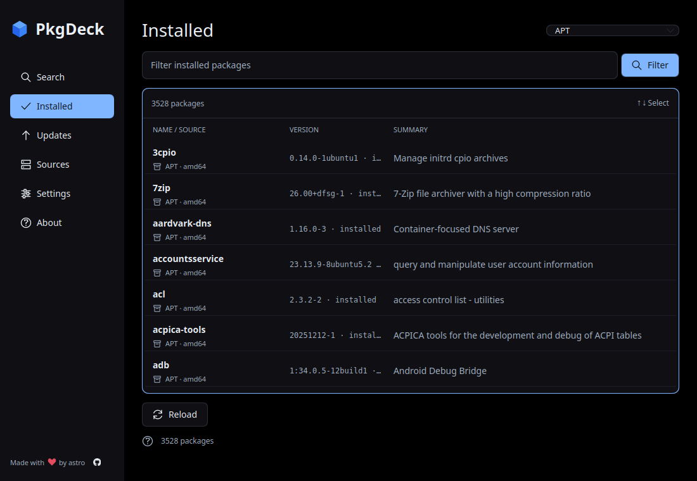
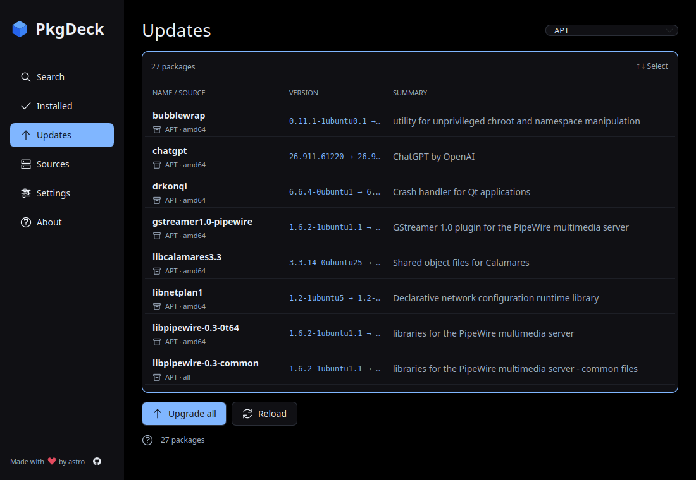

# Graphical package browser

`pkgdeck` opens the Qt/Kirigami frontend. It uses the same shared engine and
host authorization boundary as the terminal frontend.



[Light appearance](screenshots/pkgdeck-gui-light-live.png) ·
[Compact layout](screenshots/pkgdeck-gui-compact-live.png)

Captures show real local packages in the true-black dark theme.
The default appearance follows the system; Settings also offers explicit Dark and Light modes.

The sidebar provides Search, Installed, Updates, Sources, Settings, and
About. Sources reports actual source availability on the current computer;
it does not invent recommendations or combine matching names across sources.
Search submits on Enter or the Search button. Results use a virtualized ListView,
with the selected package's description, scope, homepage, and dependencies below.
The VERSION column carries the state: a bare candidate means not installed,
`· installed` marks installed packages, and `→` marks an available update.
Matching names remain separate source/architecture/scope identities.

Install, Remove, Upgrade, and Refresh source operate on the selected identity.
Updates also provides **Upgrade all** (Ctrl+Shift+U), without selecting a row.
It confirms every listed package identity, respects the selected source filter,
and is disabled when there are no upgrades or any source query failed. A hint
beside the button names the reason while it is unavailable. The batch
reports every result, including partial failures and cancellation. Completed
upgrades are not rolled back; cancellation skips remaining writes once the active
native transaction finishes. Reload reads the remaining updates.



Each write requires confirmation, with No focused initially. Refresh changes
source metadata only. Successful writes clear stale results; use Reload to read
current state. Failures and partial query results remain visible in the scrollable
status area; selecting a failed row shows the underlying manager error with a
remediation hint, without re-querying. Native dependency changes can accompany package operations.

Queries and writes execute on a Rust worker. The GUI polls a message channel and
updates Qt properties on its own thread. Search results stream in per backend,
so fast sources render while slow ones still query; the selection follows the
same package identity across partials. Hovering a package row shows its full
untruncated versions and summary. Native progress messages and an indeterminate
activity indicator replace invented percentages. Cancel interrupts
reads; an already-running native write finishes safely under its manager's lock.
Closing a busy window requests cancellation and keeps it open until completion.

Settings persist appearance, source filter, and authorization preference through Qt's
per-user settings. The source filter is also available as a selector in the
header, next to the current view name. The Installed view has its own filter
field that narrows the loaded packages by name or summary without a new
native query. The default GUI authorization uses the host polkit agent.
Existing sudo credentials are also supported; passwords are never collected by
PkgDeck. Homebrew and the development managers (Cargo, npm, pnpm, Bun, pip, pipx, uv, Composer, RubyGems) remain unprivileged. `pkgdeck --from apt|homebrew|cargo|npm|pnpm|bun|pip|pipx|uv|composer|gem --auth
sudo|polkit` overrides the saved settings for the current session.

The interface uses a consistent surface, border, and accent palette in both light
and dark mode. Text labels accompany navigation, and package metadata remains
plain text. Narrow windows replace the sidebar with a navigation selector and
compact result rows. Only applicable package actions are shown. Details and status
remain selectable and scrollable.

Results are virtualized. Up to 128 detail records are cached for the current
result snapshot, so revisiting a package avoids launching another native query.
Reloading, changing the source/view query, and successful writes invalidate this
cache. Background polling stops when work finishes.

| Shortcut | Action |
| --- | --- |
| Ctrl+F | Open Search and focus its field |
| Ctrl+L | Focus package/source results |
| Up/Down | Select a result and load its details |
| Down in the search field | Jump to the results and select the first row |
| PageUp/PageDown/Home/End | Move the selection in larger steps or to either end |
| Ctrl+1 / Ctrl+2 / Ctrl+3 / Ctrl+4 | Search / Installed / Updates / Sources |
| Ctrl+I / Ctrl+D / Ctrl+U | Propose install / remove / upgrade |
| Ctrl+Shift+U in Updates | Confirm all listed upgrades |
| Ctrl+M | Propose metadata refresh for the selected source |
| Ctrl+R | Reload the current view |
| Alt+Y / Alt+N in confirmation | Confirm / reject |
| Escape during work | Request cancellation |
| Ctrl+Q | Close, waiting safely if work is active |

## Bundled icons

Navigation, package actions, source rows, details, and the sidebar heart use original vector artwork
in `DeckIcon.qml`. CXX-Qt embeds this component in the application's Qt resources,
so native, AppImage, Flatpak, and Snap builds carry the same icons inside the
executable. They use the already-required Qt Quick Canvas renderer: no runtime downloads, host icon theme, or icon font is required. Source symbols
are generic archive/mug illustrations, not third-party logos. The original artwork follows
the repository's MIT license. The sidebar's GitHub mark is bundled from
[GitHub Octicons](https://github.com/primer/octicons) with its MIT license;
it uses the Qt SVG plugin already included in the packages. The sidebar links to
https://github.com/astrovm/PkgDeck and displays “Made with ♥ by astro”.

Qt Quick pixel tests render every icon in two colors with empty XDG icon-data
directories. Packaged GUI smoke tests use the same isolated data directories.
Icons follow the light/dark palette and disabled states. Text labels remain the
accessible names; decorative icons are ignored by accessibility tools.

## Local verification

`scripts/verify.sh full` runs Qt Quick tests against the actual Browser component,
Rust worker tests, and a real-window lifecycle using a synthetic Homebrew
executable. The real-window test creates a private Xvfb display; it does not use
the user's display or package database. It verifies native fixture state after
install, refresh, upgrade, and removal, and exercises resize and read cancellation.
Qt Quick tests cover keyboard navigation, exact confirmation, source views,
loading/errors, and closing during work. Xvfb, xdotool, and fonts are included in
the development image and desktop CI dependencies.

To check the staged release bundle against real managers:

```sh
scripts/verify.sh full
source scripts/dev-env.sh
scripts/bundle.sh
PKGDECK_FRONTEND=gui PKGDECK_BINARY_DIR="$PWD/build/AppDir/usr/bin" \
  scripts/container.sh lifecycle
```

This mounts AppDir read-only into a disposable rootless container, opens its GUI
on a private display, sends keyboard actions, and verifies synthetic 1.0 → 2.0
APT/Homebrew packages using the underlying managers. The application uses its
bundled Qt/Kirigami libraries; host commands use the sanitized host boundary.
Desktop CI runs this same packaged GUI check on x86_64 and aarch64.

The native/AppImage execution path is enabled. Flatpak and Snap host operations
remain explicitly disabled; their packaged GUI smoke checks do not claim a native
package lifecycle. Polkit and manager-lock behavior retain the shared VM tests.
Installed-format distribution validation remains a later release gate.
