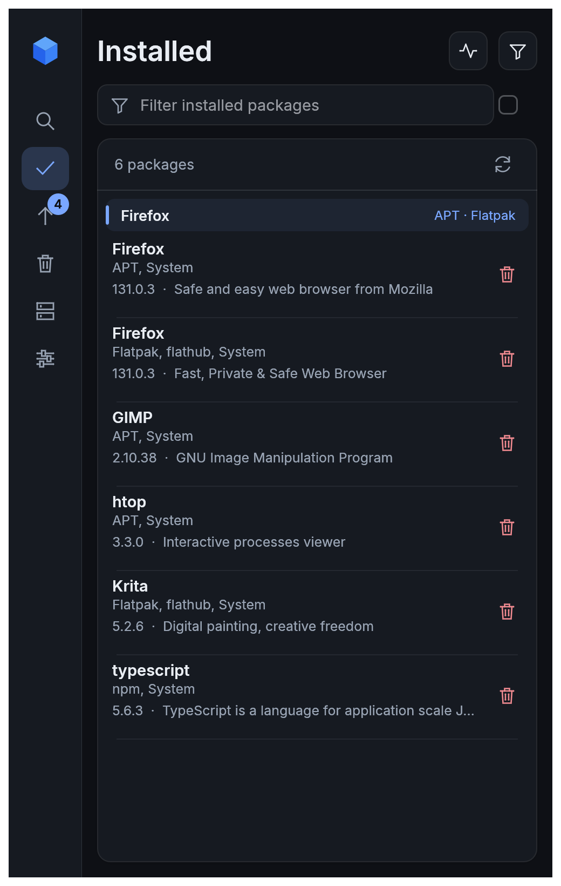
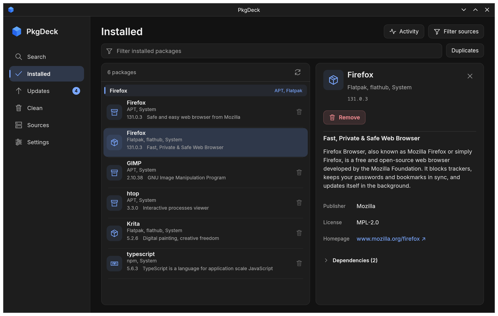
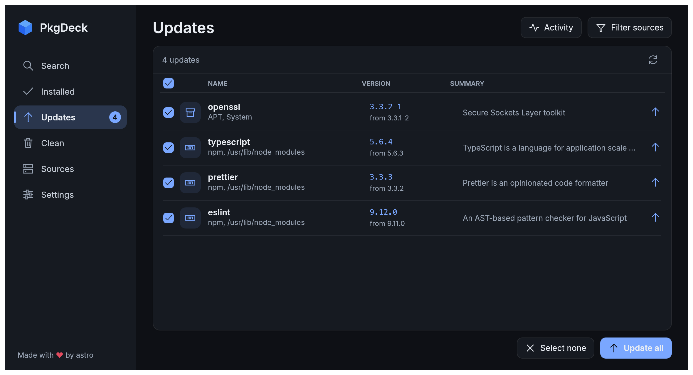
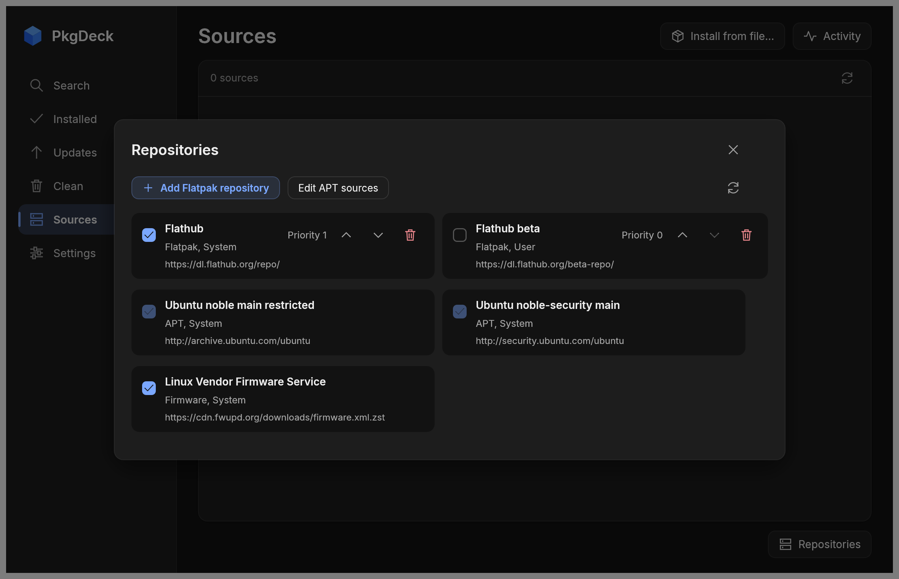

# Using the app

Open PkgDeck from your app menu or run `pkgdeck`. The sidebar has six pages:
**Search**, **Installed**, **Updates**, **Clean**, **Sources**, and **Settings**.
The **Activity** button in the header opens a side panel with running and
finished work; its badge counts changes waiting their turn.

Drag the sidebar's edge to resize it; drag it narrow to keep only its icons,
or double-click the edge to restore the default width. In narrow windows the
sidebar shows only icons.

## Search

Type an app or package name. Exact matches come first, and the same app from
different package managers is shown together. Each row keeps its own source,
architecture, and scope (User or System), so you always act on one exact
package. For Flatpak, pick the User or System row to choose where it installs.

- The button on the right of a row installs, removes, or updates that package.
  Some sources only keep what's already installed up to date, such as
  firmware and the standalone tools. Their rows show **Remove** only when
  the source can uninstall, and only when no update is waiting.
- Click a row to see its description, screenshots, publisher, license,
  homepage, and dependencies, when the source provides them. Close details
  with **×**.
- App names, icons, and screenshots come from the source. Packages without
  app metadata show their package name.

## Open a package file or link

On Search, click **Add…**, drop a file onto the window, or pass a path or link
to `pkgdeck`. If PkgDeck is already open, the file goes to the open window.
PkgDeck always shows a preview first. It never installs anything without your
confirmation.

| Kind | Formats |
| --- | --- |
| Packages | `.AppImage`, `.deb`, `.rpm`, `.pkg.tar.zst` (also `.xz`, `.gz`, `.bz2`, `.lz4`), `.flatpak`, `.flatpakref`, `.snap` with its `.assert` file |
| Repositories | `.flatpakrepo`, `.repo`, `.sources`, `.list`, openSUSE `.ymp` |
| Links | HTTPS links to any of the files above, and `flatpak+https://` links |

What the preview shows:

- AppImage: where the app will be copied, its desktop entry, and whether it
  can update itself. PkgDeck never runs the file to inspect it, and your
  original file is kept.
- Debian package (`.deb`): the changes APT would make, before it asks for
  your password.
- Flatpak reference: the app, its repository, whether a signing key is
  included, and any extra repository it needs. Choose User or System here.
  Flatpak may still download extra runtimes during install.
- RPM, Arch, and Snap files: checked by their own package manager.
- Repository files: checked again right before they are added. `.ymp` files
  open the openSUSE installer.

The file picker only lists formats that some package manager on this
computer can handle.

## Installed

Filter the list by name, or turn on **Duplicate installs** to see apps
installed from more than one source. Grouping is only visual. Each copy stays a
separate package.

These controls work on every package page:

- Click a column heading to sort it. Drag the dividers to resize columns.
- The source picker filters the current page. It also lists sources you can't
  use, with the reason.
- **Reload** gets fresh package data.

Docker and Podman images are shown as separate sources. Each row shows
tags, size, age, and image ID. You can pull a tagged image again or remove it.
Untagged ("dangling") images can only be removed. To pull a new image, select
only Docker or Podman and search for the full image name with its tag.

## Updates

Updates lists package updates and, if `fwupdmgr` is installed, firmware updates.
Opening this page, **Reload**, and the background check run `brew update` once
before they read Homebrew. Formulae and casks share that fetch, so a newly
published cask (including PkgDeck itself) can show up. The Installed page does
not fetch. The first Updates load can take longer while Homebrew fetches;
other sources still appear as they answer.

- Click a row's arrow to update just that item.
- Check several rows and click **Update selected**. When every row is checked,
  the button reads **Update all**.
- **Update all** runs one update command per package manager, so you
  approve and enter your password once. The progress bar still counts
  packages and names the one being updated, and each row shows whether it's
  done, updating, or waiting. PkgDeck reads this from each manager's output:
  Homebrew, APT, DNF, Zypper, Pacman, apk, XBPS, MacPorts, Flatpak, Snap,
  pipx, RubyGems and the Mac App Store say which package they're on, and
  PkgDeck updates Cargo, uv, pip, Composer, rustup, pixi, Nix and Conda
  packages one at a time itself. For managers that don't say (npm, for
  one), all of their rows show progress until they finish.

Cargo and Bun have no command that lists outdated tools, so PkgDeck asks
crates.io and the npm registry about each installed tool when it lists them.
Tools Cargo installed from Git or a local folder aren't checked.

Versions appear as `installed → new` when the source provides both. Some
Flatpak runtimes only report a branch or commit. PkgDeck shows what the
source reports and never makes up a version.

### Before anything changes

Every change opens a confirmation. It shows the package, source, scope, and
any extra changes the package manager plans to make. **Cancel** is selected by
default.

- APT does a dry run first and checks it again right before making changes.
  For **Update all**, packages that will be installed or removed are listed at
  the top. If the plan changes, the update stops before asking for your
  password.
- Firmware confirmations list power and restart requirements. PkgDeck never
  restarts your computer.
- **Update all** retries sources that failed to check. If a source still
  fails, the confirmation says so and its updates are skipped. The
  rest still work, and **Retry** is available in the error notice.

### Cancelling

Cancel stops work that hasn't started yet. If a package manager is already
making changes, PkgDeck lets it finish first. Finished changes are not undone
if a later step fails. Click **Reload** to see the current state.

While a change runs, its row shows a progress bar and its button turns into
**Cancel**. When it finishes, a short message at the bottom of the window says
so; for a single install or remove it offers **Undo**, which asks before
reversing the change. Removing something PkgDeck can't install again, such as
a standalone tool or an app from macOS Applications, has no Undo.

## Clean

Clean lists maintenance tasks, such as removing unused dependencies or cached
downloads. Open a task to see exactly what it will remove, or click
**Clean all**. Every task asks for confirmation, and PkgDeck checks the task
again right before running it. Sources that can't clean are not listed, and
checks that failed are shown separately.

APT finds unused dependencies without a password. It only counts cached
downloads at this stage. APT picks which cached downloads to delete when the
cleanup runs, and asks for your password then.

## Sources

Turn package managers on or off. PkgDeck remembers your choice.

The source picker filters one page. The Sources page chooses which package
managers PkgDeck checks at all. Neither one turns repositories on or off.
**Refresh sources** downloads the latest package lists for the selected
package managers.

### Repositories

Open **Sources → Repositories** to see and manage repositories.

| Package manager | What you can do |
| --- | --- |
| Flatpak | Add, remove, enable, disable, and reorder repositories, for User and System separately |
| APT | View sources; **Edit APT sources** opens your distro's Software Sources tool when it's installed |
| DNF and Zypper | View repositories; open `.repo` files to add them |
| Pacman | No repository editing; open local package files |
| Firmware (Linux) | Enable or disable firmware repositories |
| Homebrew | No repository editing; manage formulae and casks from the package pages |

If a Flatpak system installation is read-only, it's shown without edit
controls. Controls that can't work on this computer are hidden. Repository
changes use the package manager's normal signature checks and password prompt.

### pixi and Conda

**pixi** lists your `pixi global` tools and can install, update and remove them.
Updates stay within the version the global manifest records. **Conda** lists
the packages you asked for in each named conda, mamba, or micromamba
environment and can update and remove them; the environment itself stays.
Install them with the manager.
Project environments are never touched.

### Rustup and Nix

**rustup** lists your Rust toolchains and can install, update, and remove
them. Channels update within their channel; pinned versions never do.
Toolchain updates never update rustup itself: it has its own row. The default
toolchain can't be removed. **Nix** lists your user profile (`nix profile`),
never NixOS or Home Manager configuration, and can add, upgrade, and remove
entries. It never shows updates, because only evaluating the flake can tell;
upgrade an entry with `pkd upgrade NAME --from nix`. See the
[CLI guide](cli.md#choosing-packages).

### Oh My Zsh

**Oh My Zsh** lists your Oh My Zsh folder (`$ZSH`, usually `~/.oh-my-zsh`).
It also lists plugins and themes you cloned with git into `$ZSH_CUSTOM`.

- They show as `plugin/NAME` and `theme/NAME`.
- Only update checks go online (`git fetch`).
- Updates fast-forward. A checkout with your own changes is left alone and
  shows as failed.
- PkgDeck never installs or removes these.

### AUR

On Arch, the **AUR** source lists installed packages that aren't in Pacman's
repositories and shows which have a newer AUR version. They're no longer
listed under Pacman. Updating runs your AUR helper (paru or yay), and the
confirmation links what changed in the PKGBUILD: building one runs it, so
review it first. Removing builds nothing: Pacman removes the package, with
the same password prompt as any other. PkgDeck never installs AUR packages.
See the [CLI guide](cli.md#arch-user-repository-aur).

### Toolbx and Distrobox

On Fedora Silverblue and similar systems, the **Toolbx containers** and
**Distrobox containers** sources list your development containers and update
the packages inside them with each container's own package manager. Removing
one deletes the container and everything installed in it, even while it runs;
your home folder stays. Containers are never created.

### Image-based systems

On Fedora Atomic, CoreOS, and other bootc or rpm-ostree systems, the
**System image** source shows the whole OS as one row, including an update
waiting for a restart. Updating downloads the new deployment; it applies on
the next restart. PkgDeck never restarts your computer. Packages layered with
`rpm-ostree install` have rows of their own: they update with the system,
and removing one takes it out of the next deployment. The system image
itself can't be removed.

### apk, XBPS, and MacPorts

Alpine's apk, Void's XBPS, and MacPorts work like the other system package
managers. MacPorts keeps variants when it upgrades and lists only active ports.

### Mac App Store

With [mas](https://github.com/mas-cli/mas) 7 or newer installed, the **Mac App
Store** source lists apps installed from the App Store and shows which have
updates. Updates need your Mac password, which mas can only ask for in a
terminal. If PkgDeck can't get it, it says so; run `pkd upgrade --from mas` in
Terminal, or update in the App Store app. Automatic updates skip them. PkgDeck
never installs App Store apps.

**Remove** moves an App Store app to your Trash, where you can drag it back
out. App Store apps belong to the system, so macOS asks for your administrator
password first; Cancel leaves the app where it is. Quit the app before removing
it: PkgDeck refuses apps that are open. Afterwards PkgDeck checks that the app
left and that the App Store no longer lists it.

### macOS updates

The **macOS Updates** source lists what Software Update has pending: macOS
point releases, Safari, the Command Line Tools and the like. Update checks ask
Apple's servers; every other page reads the last check. Installing asks for
your administrator password. An update that needs a restart is downloaded, not
installed: finish it from System Settings > General > Software Update. PkgDeck
never restarts your Mac. Upgrades to a new major version of macOS aren't
listed; System Settings offers those. Automatic updates only download them;
installing stays with you.

### macOS application inventory

On macOS, the **macOS Applications** source lists bundles in `/Applications`
and `~/Applications`, including folders such as Utilities. It shows the observed
version, location, and whether the active Homebrew installation has an app
artifact pointing to that exact copy, whether an installed cask's installer
package wrote it (its receipts), or whether a renamed cask left its app link
under the old name. An unavailable Homebrew check is shown as unknown; a missing
record does not prove the app is unmanaged.

VS Code, Firefox, and Obsidian bundle identifiers have curated cask suggestions.
**Available through Homebrew (candidate)** means an install route exists for
that product. Open details to see the matching evidence. Publisher, channel,
architecture, and artifact equality are not verified by the suggestion itself.
App Store receipt-bearing copies get no suggestion. For VS Code, Firefox and Obsidian,
installing the suggested cask lets Homebrew manage the copy you already have,
after PkgDeck checks its signature, version, architecture, and files, and keeps
a copy until Homebrew finishes (see the [CLI guide](cli.md#letting-homebrew-manage-an-app-you-installed)).
Such a copy, with no App Store receipt and no Homebrew owner, gets a **Manage
with Homebrew** button on its row and in its details while the Homebrew Casks
source is available. It looks the cask up through Homebrew Casks, runs these
checks, and opens the usual confirmation with what Homebrew will take over. It
is offered only when that cask would manage this exact copy, never a second
install, and a finished handover has no Undo, since removing the cask would
delete the app.

This source never installs or updates apps. **Remove** takes an app off the Mac:

- Homebrew uninstalls an app its cask manages, the same as removing the cask.
- Any other app goes to your Trash. Apps you own go without a prompt; apps that
  belong to the system, such as App Store apps, go after macOS asks for your
  administrator password.
- Apps that come with macOS (Safari, and anything System Integrity Protection
  guards), aliases, and open apps are refused with the reason. So is an app
  that Homebrew's records can't be checked for, or that two casks claim.
- Right before removing, PkgDeck checks that the bundle at that path is still
  the one it listed, and afterwards that it is gone.

Copies already listed under Homebrew also appear in this inventory with their
ownership label. Helper apps inside bundles are excluded; aliases to the same bundle are
listed once. Discovery covers up to four levels of subfolders and does not follow
directory symlinks. Unknown versions remain explicitly unknown.
Unreadable subfolders are skipped and reported as source errors; readable sibling
apps remain visible in the partial inventory.

### Standalone CLI tools

Codex, Claude Code, Grok, OpenCode, Cursor CLI, GitHub Copilot CLI, Kiro CLI,
Antigravity CLI, Amp and Factory Droid installed with their official installers show up in Installed and Updates,
and so do the Solana CLI (Agave), Anchor through AVM, and Foundry. PkgDeck updates them with their
own updaters and can remove them, without admin rights. Removing takes away
only what the tool's installer put there and keeps your settings, sign-ins and
keys; on macOS the files go to the Trash. It can't install them. Copies
installed with npm or Homebrew are managed by that package manager instead.
See [supported install layouts and what removal keeps](cli.md#standalone-cli-tools).

## Update notifications

**Background checks** are on by default: PkgDeck checks for updates while it
is running. Turn them off in Settings.

- The first check runs about 30 seconds after launch, then at most once per
  **Check every** interval: 15 minutes to a week, 30 minutes by default. The
  Updates page refreshes in the background no more often than that either.
- Checks wait while you're offline, on a metered connection, or while another
  package operation is running.
- **Start in background at login** keeps checks running after you log in.
  On Linux it adds an autostart entry; on macOS it adds a LaunchAgent,
  `~/Library/LaunchAgents/io.github.astrovm.PkgDeck.plist`.
- On macOS, click the menu bar icon and choose **Open** to show the window.
  Its menu also has **Check now** and **Quit**. Elsewhere, click the tray
  icon to show or hide the window; that menu has **Check now** and **Quit**.
  Clicking a notification opens Updates.
- When your desktop has a system tray, closing the window keeps PkgDeck
  running there. Use **Quit** in the tray menu to exit. On macOS, Cmd+Q and
  **Quit PkgDeck** in the app menu quit too, Cmd+W closes the window to the
  menu bar, and clicking the Dock icon brings it back.

You get one notification for each new batch of updates, including on the first
check. PkgDeck remembers what it already told you about, even after a restart.
If one source fails, updates from the other sources still trigger a
notification.

### Automatic updates

Turn on **Install updates automatically**. When a background check finds
updates, PkgDeck installs them and sends one notification.

- Each run shows in Activity, marked **Automatic**.
- It waits if another change is running, and skips sources whose check
  failed.
- Sources that run as you (Homebrew, Oh My Zsh, Cargo, npm and other
  developer tools) update right away.
- Firmware, the Mac App Store, apk, XBPS, the AUR, Toolbx and Distrobox
  never update automatically.

#### Updating PkgDeck itself

When an update replaces PkgDeck (its Homebrew cask or formula, Flatpak, Snap,
AppImage or system package), the running copy is still the old one:

- After an automatic update, PkgDeck restarts on its own a few seconds later,
  once nothing else is changing. A hidden window stays hidden.
- After an update you started, PkgDeck offers a **Restart** button.

#### System packages

System packages need **Allow automatic updates without a password**.

- It asks for your password once, to turn it on.
- It only covers automatic updates. Anything you start yourself, **Update
  all** included, still asks.
- Without it, system updates only notify you. Automatic updates never show
  a password prompt: a Homebrew cask whose installer needs your password
  fails right away and stays in **Updates** for you to install.

What it saves:

- Linux: a polkit rule,
  `/etc/polkit-1/rules.d/49-pkgdeck-unattended-USER.rules`. It lets
  PkgDeck's helper refresh and update everything from APT, DNF, Pacman,
  Zypper, system Flatpaks and Snaps, only in your active local session.
  The helper does nothing else in that mode.
- macOS: a sudoers entry, `/private/etc/sudoers.d/pkgdeck-unattended-USER`,
  checked with `visudo` before it's saved. It allows exactly
  `softwareupdate --download --all --no-scan` and, when MacPorts is
  installed, `port -N selfupdate` and `port -N upgrade outdated`, without
  your environment, so your settings can't change what runs as root. Nothing
  else gets past sudo's password prompt. Homebrew casks and the App Store run
  sudo themselves for whatever their installers need, which no exact command
  covers, so they're left out.
- Turning it off deletes the file.
- On Linux this needs the system Flatpak, the Snap or your distro's
  package. AppImages, user Flatpaks and Homebrew can't use it.

#### Updates that remove packages

**Allow updates that remove packages** is on by default.

- Some updates replace packages, like an old kernel.
- **Update all** shows them before you confirm.
- Turn it off to skip APT updates that would remove packages. This applies
  to **Update all** and automatic updates.

A Homebrew cask whose installer needs an administrator password asks for it
when you update it yourself.

## Performance

PkgDeck shows saved results right away, for up to 60 seconds, and marks them
as saved. Older results stay on screen, whole, until fresh ones finish
loading. Installed, Updates, and Clean load in the background after you leave
Search. Installing, removing, or changing repositories marks saved results as
out of date, and each page refreshes when you open it.

## Keyboard shortcuts

| Shortcut | Action |
| --- | --- |
| Ctrl+1 to Ctrl+5 | Go to Search, Installed, Updates, Clean, or Sources |
| Ctrl+, or Ctrl+6 | Open Settings |
| Ctrl+J | Show or hide Activity |
| Ctrl+F | Focus the search field, package filter, or source picker |
| Ctrl+L | Move to the results list |
| Enter | Install, remove, or update the selected row |
| Ctrl+R | Reload the page |
| Ctrl+Shift+U | Update checked packages |
| Ctrl+Enter | Apply the open confirmation (Alt plus the underlined letter also works) |
| Esc | Clear the search, or close the details |
| Ctrl+M | Refresh the source's package lists |
| Ctrl+Q | Quit (waits for any running package change to finish); on Linux, with background checks on, it closes to the tray |

On macOS, Cmd takes the place of Ctrl and Settings shows the shortcuts with
Mac key symbols. Refreshing package lists is Shift+Cmd+R there, because
Cmd+M minimizes the window, and Cmd+W closes it.

Use Tab to move between controls. Column headings also sort with Space or
Enter, and Shift+Left or Shift+Right resizes a focused column. Row actions and icon buttons have screen reader labels.

## Platforms

The app runs on Linux, and on macOS through Homebrew. Which sources you see
depends on your system and installed package managers. With Homebrew 6.0 or
later, Homebrew Casks also work on Linux: search shows only casks Linux can
install (AppImages, command-line tools and fonts), and AppImages a cask
installed are listed under Homebrew Casks rather than as unmanaged AppImages. On macOS, AppImage
support is hidden.

When a change needs administrator rights, the app always asks with your
system's password prompt: polkit on Linux, and the standard administrator
password dialog on macOS. There is no setting for this, because a sudo login
from a terminal doesn't carry over to the app. Some Homebrew casks run `sudo`
themselves, for example to remove Docker Desktop's helper tools; the macOS
app then shows a password dialog for Homebrew. If you cancel it, that change
stops and the error says Homebrew didn't get your password. The Flatpak
and Snap
builds manage your system's packages, not just sandboxed ones. See
[packages and releases](distribution.md) and
[host access and authorization](host-execution.md).
