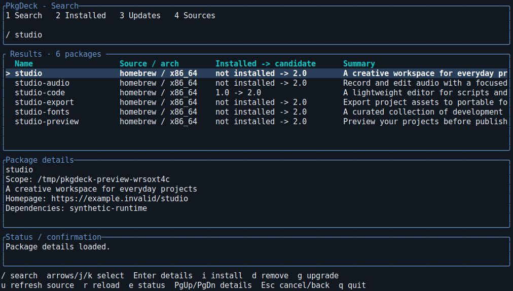
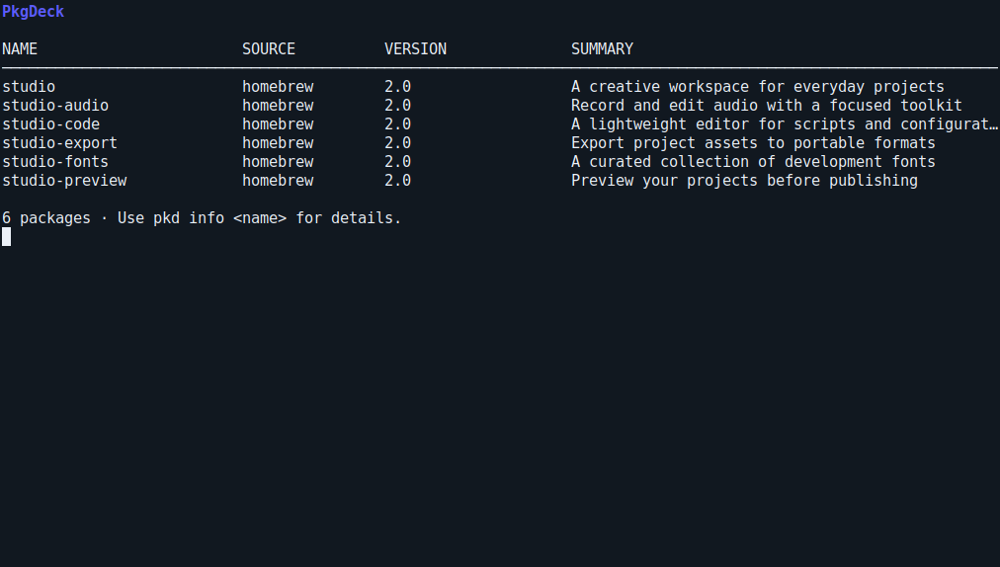

# Interactive terminal interface

Run `pkd` in a terminal. `--from apt|homebrew` restricts sources and `--arch`
filters package rows. Both input and output must be terminals. Qt and a display
server are not required.

| Key | Action |
| --- | --- |
| `/`, `1` | Edit search; Enter submits, Escape leaves editing |
| `2` | Installed packages |
| `3` | Packages with native updates available |
| `4` | Sources, availability, and capabilities |
| Up/Down, `k`/`j` | Select a row; details summary follows selection |
| Enter | Load the selected package's full details |
| Page Up/Down | Scroll details, expanded status, or confirmation |
| `i` | Install the selected uninstalled package |
| `d` | Remove the selected installed package |
| `g` | Upgrade the selected package with an available update |
| `u` | Refresh the selected available source's metadata in Sources |
| `y`, `n` | Confirm or reject a proposed operation |
| `r` | Reload the current results |
| `e` | Expand status/errors; Escape returns |
| Escape, Ctrl-C, `q` | Cancel active work; otherwise go back or quit |

Search runs only on submission. Rows retain backend, architecture, and scope;
matching names from different sources are separate selections. The confirmation
shows the exact identity. Every write requires confirmation, including when
`--yes` was supplied. Native dependency changes may accompany the requested
operation. Refreshing metadata never upgrades packages.

The results table stays above selection-linked details. Wide terminals include a
summary column; narrower terminals prioritize identity and versions. Rounded
borders, colored headings, and a distinct selected row follow the soft reference. Text labels require no
icon font. Smaller terminals show fewer rows and shorter details; scrolling and
expanded status keep longer content accessible. Package metadata control
characters are replaced before display.

The terminal redraws only after input, resize, or a backend update, avoiding
rebuilding package rows during idle polling. Queries and writes run on a worker
thread. Native progress messages appear in the
status area; there is no invented percentage. Escape requests cancellation.
Reads can stop, while a native write already running finishes under its manager's
lock. The UI remains open until completion and reports deferred cancellation.
After a successful write, stale package rows are cleared; press `r` to reload.
Failures and partial query results remain visible; `e` opens their full message.
SIGTERM requests the same safe shutdown and terminal restoration. SIGKILL cannot
be handled.

APT defaults to the existing noninteractive sudo authorization path. Establish
credentials with `sudo -v` in the same terminal before launching `pkd`, or use
host-configured authorization. A missing grant is reported as authorization
denied; the TUI never reads passwords. `pkd --auth polkit` uses a configured host
polkit agent, which may require a graphical session. Homebrew stays unprivileged.
See [the host contract](host-execution.md) for sandbox restrictions.

## Captures

Actual terminal output with synthetic package metadata:

Human CLI output uses aligned tables, labeled package details, and explicit
operation results. Piped output contains no color escapes; `NO_COLOR` also
disables color. Narrow terminals omit trailing columns; use `info` for complete
metadata or `--json` for the unchanged machine-readable contract.

## Verification

Rust tests drive keyboard actions against a synthetic engine and render wide,
narrow, and tiny terminals. PTY tests exercise the executable with a synthetic
Homebrew transport, keyboard navigation, cancellation, resize, SIGTERM, and
terminal restoration. Synthetic executables write only to temporary directories.

`scripts/verify.sh containers` runs CLI and TUI lifecycle suites in separate
rootless containers. The TUI suite uses real APT/Homebrew tools with synthetic
1.0/2.0 packages, sends keys through PTYs without a display, and verifies final
state through the native managers. The existing VM suite retains sudo/polkit and
native lock checks.
